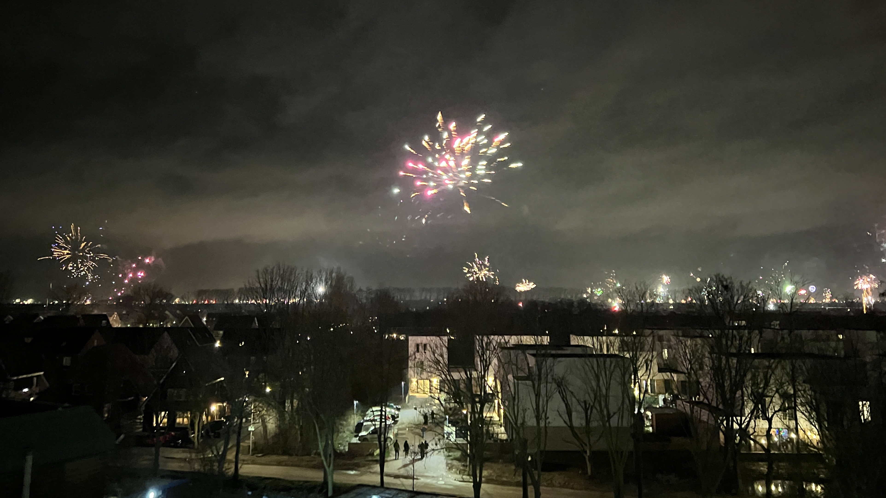
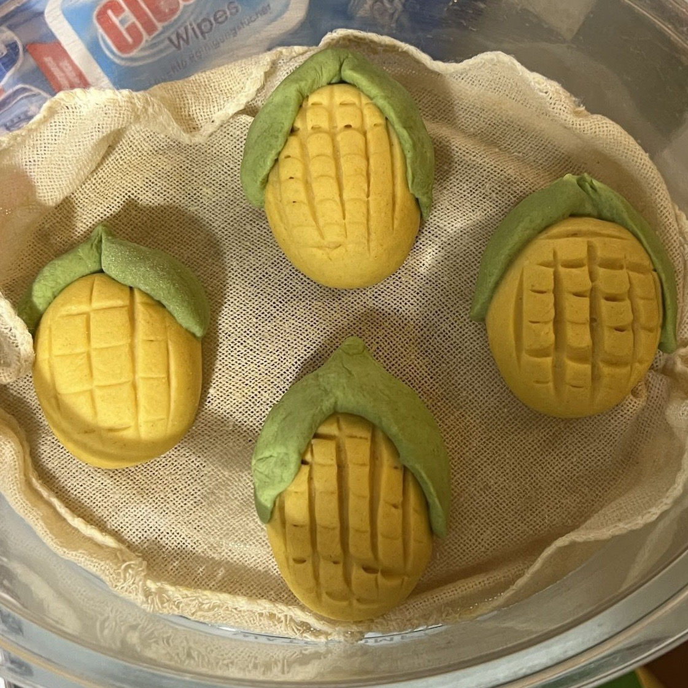
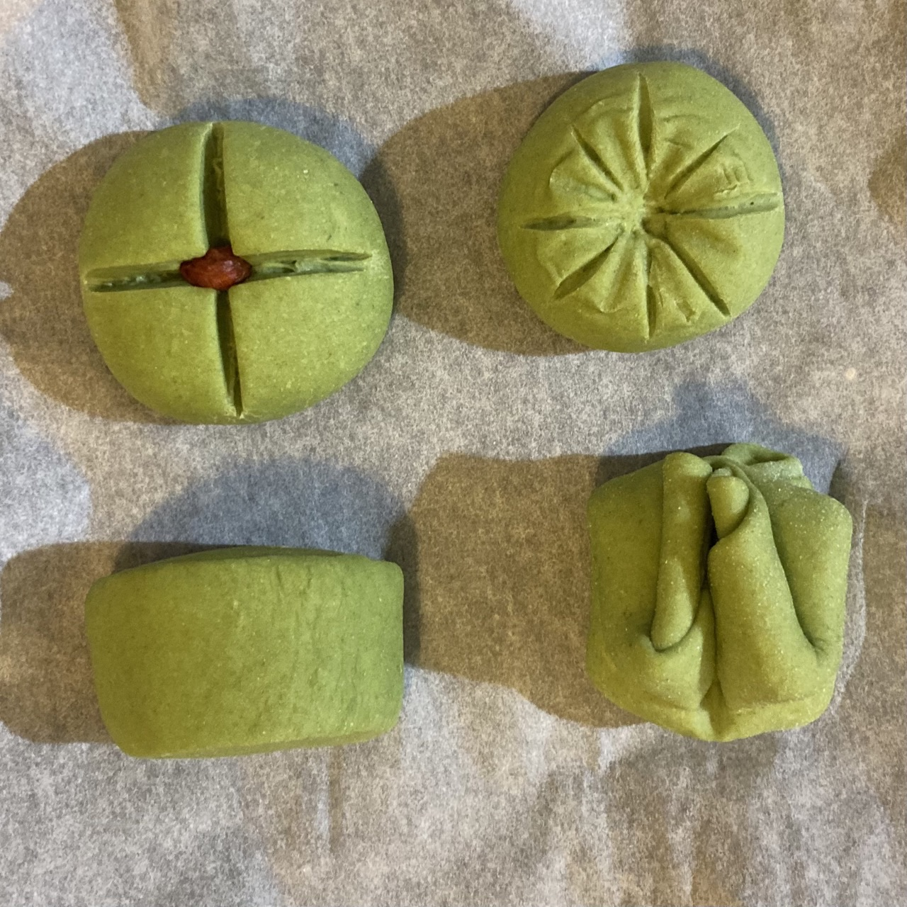

本篇是对`2023-12-31` 到 `2024-01-06` 这周生活的回顾与反思。

## Cheers to a New Beginning

跨年夜和熊小花在朋友家度过。虽然我们忘记带 switch 手柄了，但还好 Everybody 1-2-Switch! 支持手机联机进行游戏，在玩游戏的时候，窗外已经零散有些烟花了。当还有 30 秒进入新年的时候，我们急急忙忙地走向阳台，置身于了整座城市的烟火之中。在凛冽的冷风中我们互祝新年，看着远方的地平线被烟花点亮，然后跨入了 2024。

## 生活

### 年度计划的日常困境

去年 12月30号，我和熊小花一起列了 2024 年的计划。在新年开始，我们一起打卡，虽然果然还是高估了自己的行动力，但是有个目标总是好的。之前看到 Marc Backes 制作的 [Goals for 2023 🎯](https://marc.dev/goals/2023) 网页，量化+可视化 (and in style) 地更新和鼓励自己完成年度计划，这给了我灵感，我想到的第一个场景就是将自己的待读书单列上去，push 自己好好看书。

### 馒头

自从去年年底在 Action 买了电子秤之后，我终于从 “少许” 和 “适量” 的困境中摆脱，发面取得了突破性地进步，并保持了稳定的水平。这一周，在被小红书算法击中的熊小花要求下，我们尝试用南瓜和菠菜做彩色馒头，除了菠菜因为未知的原因没有太发起来，最后吃起来有些硬之外，总体还是成功的。做到最后，我们都有了小时候做手工的快乐。

### Manuscript Reviews

新年的第一个工作日，我收到了 Manning Publications 审阅 [《Django in Action》](https://www.manning.com/books/django-in-action) 书稿的新邀请。此前自己已经参加了两轮的审阅，但因为这本书书稿是陆续放出，所以这次会审阅新的章节。没想到自己可以从一个读者和消费者，变成业余的 reviewer ，但之后阅读的时候也需要更加仔细，因为我了解 debug 半天后，发现是作者错误时的沮丧。未来的 3 周，我会审阅这本书的新样稿，并再温习下 Django。

这周收到了入选参加 [The National SDG Challenge](https://university.sdg-challenge.com/) 的正式确认邮件。去年夏季申请的时候自己落选了，但这次入选了 Winter edition。这次我被分配到了 IBM Team，IBM 给出的问题很实际但也是我喜欢的方向，而且可以利用上自己之前的经验。之后在主办方创建的 whatsapp 群中，我通过大家的自我介绍，发现我们 team 的组成还挺多元，大家的专业、文化背景和爱好各不相同，但是又有着同样的目标，这次应该会是一段有趣的经历。

### 韩剧

这周和熊小花看完了名声在外的《鱿鱼游戏》。整部剧是一部优秀的商业剧集，双线叙事下的节奏把控很好，最后收尾也比较完整，没有留下坑。瑕不掩瑜的是，为给第二部做个铺垫，结尾有些太刻意了。

剧集中的血腥镜头直白到了不必要的程度，甚至有些《电锯惊魂》的风格。我和熊小花讨论之后，发现自己也正如那些贵宾一样，在镜头后面看着这一场“赛马”，并从这种血腥和残酷中获得体验，这种现实和剧集的镜面映射，不知道是导演有意为之，还是我们的过度解读。

在熊小花的安利下，我们开了《请回答1988》，虽然只看了一集，但我已经喜欢上这部剧了。这部剧虽然是 2015 年播出的，但很细腻的把握了 1988 年的历史氛围：在1997年六月民主运动中，摆脱军政独裁，走向民主的韩国第六共和国，不满周岁就要举办 1988 年的汉城奥运会，与之而来的复杂的情绪有韩国重新迈向世界的悸动、亚洲经济奇迹下的乐观主义还有人回归个体生活的真实感，剧中挂在奥运场馆的一条标语很好的体现了这种期待：

> 世界走向首尔，首尔走向世界。

## Data Science

这周继续保持了每天看一个 Datacamp 的 section 的计划，并且完成了 [Introduction to Statistics in Python](https://www.datacamp.com/courses/introduction-to-statistics-in-python) 课程。这门课程的内容没有那么艰深，但是恢复了对统计学的好奇心——在过去几个月内，它被 pre 的统计学课程持续消磨。
这个课程学到了 statistics distributions，之后准备写篇博客单独总结下。
另外，本着 [learn in public](https://www.swyx.io/learn-in-public) 的原则，我:

- 将记在 jupyter notebook 的学习笔记，都上传至了 [GitHub](https://github.com/Celqaz/DSProPyNotes)。

- 在 freeCodeCamp 的 [discord](https://discord.com/invite/freecodecamp-org-official-fi-fo-692816967895220344) 上，重新参加了 #100DaysOfCode 的活动。

## 实习

进入学期结束和圣诞假期，自己也没有继续投实习。之前有过积极沟通的 ASML，这周还是发了拒信，不过自己已经熟悉投实习的流程了，之后还是会继续投。既然都到荷兰了，有机会的话，还是想到 ASML 的工作环境中体验下，毕竟光刻机是现代工业体系皇冠上的明珠。

放假前还投了另外一家公司的实习，但因为跨了圣诞假和新年假，等待的时间比较长。我本来以为没有什么机会了，随后发邮件问了一下进度，结果得到了可以参加下一轮 Technical Assessment 的机会。本来以为只是基础编程能力的测试，没想到用了很多数理知识和 Data Manipulation 的操作。这里值得庆幸的是，好在自己从放假之后，就一直在 Datacamp 上学习 Data Scientist Professional with Python 课程，所以解法需要的知识自己都有印象，甚至其中需要的统计学知识都是当天早上刚好学完的。整体的 solutions 自己还比较满意，希望下周会有新的进展。

## 阅读

### 《献给名侦探的甜美死亡》

这周继续阅读了方丈贵惠的[《献给名侦探的甜美死亡》](https://www.douban.com/doubanapp/dispatch?uri=/book/36316842)。本书前半部分略带中二的对话风格和不太自然的剧情推进，一度让我有些读不下去。但是当作者利用推理发生在 VR 世界中的设定，给出了死者发言环节，又让我有了兴趣，并随着情节地展开，发现了作者的一些巧思。方丈贵惠在之前出版的——[《孤岛的来访者》](https://book.douban.com/subject/35922834/) 一书中，就显示了自己对推理小说的独特理解：充分利用世界设定创造新颖的谜题，同时坚守本格推理的原则，给读者公平的推理机会。因此，感觉这本感觉这本《献给名侦探的甜美死亡》还是可以继续阅读。

### 《Chip War: The Fight for the World's Most Critical Technology》

本周还按照年度的阅读计划，开了Chris Miller 的 《Chip War: The Fight for the World's Most Critical Technology》。虽然我目前还没有读到正文，但从 Cast of Characters 和 Glossary 的拓展阅读中，我了解了之后孵化 Silicon Valley 的 Fairchild Semiconductor ，目前芯片的主要架构(x86, ARM 和 RISC-V) 以及 [ARM 的商业故事](https://www.cnbc.com/2023/11/09/how-arm-gained-chip-dominance-with-apple-nvidia-amazon-and-qualcomm.html)。也是因为初期需要补的知识太多，所以阅读的进度并没有达到预期，但是发掘故事本身也是阅读非虚构的乐趣之一。

### 《百年孤独》

去年年底的期末考试，让我不得不暂停读得渐入佳境的[《百年孤独》](https://book.douban.com/subject/6082808/)。考完再想拾起的时候，却发现自己轻易就被布恩迪亚、奥雷里亚诺、布恩迪亚第二和奥雷里亚诺第二等人物名称和关系搞混了，之后勉勉强强读完。上周阅读共读书友记的笔记，又再次回顾这本书，但是从一个更为现实的历史背景角度，了解了哥伦比亚、巴拿马和美国纠缠的历史，还有那场布恩迪亚上校从未走出的战争的蓝本—— [Thousand Days' War](https://en.wikipedia.org/wiki/Thousand_Days%27_War) 。

## Weekly Gems

### 纪录片

- [《中原记事》](https://www.youtube.com/watch?v=wrflkuSJEs4)

  今年的读书清单还有一本[《高潔的靈魂》](https://www.goodreads.com/book/show/51569303--?from_search=true&from_srp=true&qid=QTUXbibu40&rank=1)，最近，又看到柴静分享了《中原纪事》这部关于高耀洁医生的纪录片，我准备之后在读书期间观看。

### 书籍

- [《Zhou Enlai - A Life》](https://www.hup.harvard.edu/books/9780674659582)

  之前出过 [《邓小平时代》](https://www.hup.harvard.edu/books/9780674725867)的Harvard University Press， 今年待出版的这本周恩来传也让人期待。

### Code

- freeCodeCamp 最近发布的 [Mastering Behavioral Interviews for Software Developers](https://www.freecodecamp.org/news/mastering-behavioral-interviews-for-software-developers/) 也是不错的资源，尤其是自己在参加了几次面试后，感觉国外在能力相同的情况下，更看重 candidates 和既有团队的匹配性，所以了解这方面问题也会有一些帮助。

- 这周还看到了有人推荐了学习曲线更平滑的 [Command Line Applications in Rust](https://rust-cli.github.io/book/index.html)，正好自己最近想学一下命令行相关的知识，自动化处理一些日常任务，所以这个可以作为自己之后的学习资料。
