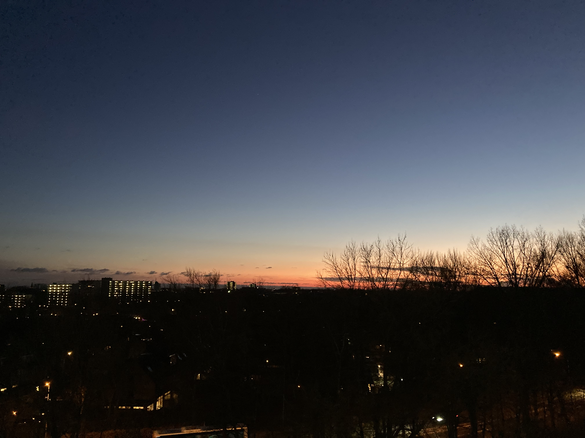

本篇是对`2024-01-07` 到 `2024-01-13` 这周生活的记录与思考。

<iframe
	style='border-radius:12px'
	src='https://open.spotify.com/embed/track/0P3w8D7NAJb5xYvSQBpHq9?utm_source=generator'
	width='100%'
	height='152'
	frameBorder='0'
	allowfullscreen=''
	allow='autoplay; clipboard-write; encrypted-media; fullscreen; picture-in-picture'
	loading='lazy'
></iframe>

## 强风吹拂

周日下午难得出了太阳，于是出去在冬日跑了 2024 的第一次步。
受到 [running_page](https://github.com/yihong0618/running_page) 项目的启发，决定重新下回 Nike Running Club——这是自己第一个使用的跑步 app，在大学时跑的人生第一个 10 km，就是用这个 app。当它去年决定退出中国时，我还备份了自己的数据，虽然现在已经忘记备份到哪里了:( 但当自己重新下回 app 时，惊喜地发现之前的跑步记录都还在，于是今年更没有理由放弃跑步了。

虽然知道窗外的太阳是假的，并不能提供什么热量，但是自己还是低估了荷兰的冬日寒风，选择穿了透气性还不错的衣服。我选择了 2 公里的距离，但是在跑步的过程中产生的热量，全部被风吹走了，身上完全热不起来，自己想通过提速而发热的努力也最终失败，在外的双手逐渐失温，指尖冰凉。在结束跑步的时候，当想要操作手机结束 app 的跑步记录，手指都有些僵硬。

这就是我对新年冬天的体验，而所有寒冷，也在回家后的一场热水澡后，化成舒缓的氤氲水汽。在洗完澡后，突然想到 1 月是箱根驿传的时间，我记得去年在国内的时候，还看到有直播源。可惜的是，今年的箱根驿传已经在 1 月 3 日结束了，在今年这第100届箱根驿传上，青山学院大学夺冠，并刷新了赛事记录，真是美好啊。自己了解这个赛事也是因为《强风吹拂》，虽然这本书有“燃”这个标签，自己也被其中的热血感染，但是时至今日，自己想到这本书时，感受到的只有跑者在强风吹拂中的轻盈。村上春树在《当我谈跑步时我谈些什么》说“正是因为不想跑，所以更要去跑，这是长跑者的思维方式。”，跑步吸引我的也是这点，很多时候最大的困难只是迈出第一步：每次自己想偷懒不去跑步的时候，就想着只跑个 1 公里，但结果往往可以跑到 5 公里或更远，而且越跑越轻盈。

## SDG Challenge

这周 SDG Challenge 正式开始。在 Kick-off Online Meeting 上，我发现在这次的 5 个 partner 中，我只认识自己 Team 所属的 IBM。
第二天起床准备赶车参加 Inhouse Sprint 时，外面天都没有亮。在等车时还遇到了公交车晚点，自己匆匆赶去另一个站台等车，才没有近一步延误行程。到达阿姆后，又因为 Metro 延误，自己错过了公交摆渡车，只能步行到 IBM。在 IBM，接待的人握手之后，惊讶于我没有戴手套，我这个时候才发现自己在荷兰骑车太久了，已经缺乏了步行出门装的常识。

在 IBM Netherlands，我才知道 IBM 还有 Consulting 这条业务线，这次过来和我们讨论的也全部都是这条线的人员。在一整天的活动中，我们讨论了海运的 sustainability 。我了解到海运运送了全球 40% 的能源和超市中 80% 的百货，因此，海运也直接影响了全球经济和供应链的稳定。然而，这些仅仅发生在海洋中的旅程，却鲜为终端消费者所知。虽然一些头部公司已经发起并推动旨在低碳化海运的 [cozev](https://www.cozev.org/) 标准，但是 sustainability 的议题，尚未由社会传导至海运领域。

推动海运的 sustainability 需要独特的融资方案，但是目前获取融资存在以下问题：

- 银行需要对底层资产的掌握，但是货船在离港后失去网路通信，无法同步传输的数据会造成不确定性
- 同时，数据采集方面也会是一个困难的过程，为货船布置传感器需要成本，而且在确定采集怎样的数据，以及 data integration 上，都还需要探索出统一的标准。
- 此外，货船在平均的生命周期为 20 年，在 20 年后，如何提升货船的 residual value，并以一种可持续化的方式报废或再利用货船，成为新的挑战。

海洋相关的故事让我着迷：海洋文明的发源，纷繁的洋流对历史和地理的塑造、大航海时代游戏中对世界的探索，都激发着我的好奇心。而这次通过海洋来观察当代和未来社会，可能也会提供有趣的视角和故事。

## 生活

### 剧集

这周和 熊小花 把 请回答1988 看了一半，上周我们在感慨剧集对上世纪的还原，这周我们在惊讶编剧对细腻亲情的把握，尤其是父母和子女之间复杂微妙的感情。虽然我可以猜透编剧在泪点的小套路，但每次都还是会骗到，应该是总能在这部剧中找到自己和家人生活的影子，而这种微小的片段，可以跨越 8000 公里将我和家人连接。

### 捕虫堇或米开朗基罗

有天下午天气太好了，我和 熊小花 出门散了步，路上还见到了寒风中看起来畏畏缩缩的羊和马。我们的目的地是一家大型园艺店，里面放置了各种花和园艺用具。我们给龟背竹挑选了一个固定它枝干的杆子，回家的路上，还从奥斯汀，伍尔夫，米开朗基罗中，选定了 米开朗基罗 作为家中捕虫堇的名字。

### Data Science

这周继续在 Datacamp 上继续 Data Scientist Professional with Python 的 Track,本周完成了 Introduction to Data Visualization with Matplotlib 的课程，主要学习了：

- 绘制基础的 histogram, scatter plot, bar plots, boxplots
- 使用两个 Y 轴绘制两种不同类型的图
- 存储图像的正确方法，而不仅仅是在 jupyter notebook 中，右键另存为。
- 还学习了如何使用 yfinance 加载上市公司的交易数据

本周的学习笔记更新在 [8_Introduction_to_Data_Visualization_with_Matplotlib](https://github.com/Celqaz/DSProPyNotes/tree/master/8_Introduction_to_Data_Visualization_with_Matplotlib)

### 实习

在完成最后一轮面试后，收到了拒信。在完成了 4 轮测试后，得到这样的结果自己自然还是有些失望，不过起码验证了自己之前选择的 financial risk management 的职业方向，也发现了自己在职场英语的交流上仍存在一些需要提高的地方。接下来需要规划下 master 的课程安排，腾出时间在下半年找实习。

## 输出

过去的一周，写了一篇 [weekly reflection](https://www.byteli.com/post/life/weekly-reflection-week-1/) 和 学习的文章 [Exploring CDF vs PPF in SciPy: Understanding Probability Functions](https://www.byteli.com/post/datascience/cdf-and-ppf-in-in-scipy/)，虽然写的过程充满了逐渐拾起表达能力的不适感，在好久没有写作之后，有这样的开始自己感觉还是很满意。

在写文章的过程中，发现目前自己博客网站使用的[模版](https://github.com/danielcgilibert/blog-template)，竟然不支持 Math typesetting，于是研究了一下午，将 [Katex](https://katex.org/) 集成到了网站中。

另外，自己在上周开始做 Django in Action 的 Review，但是进度不及预期，上周一共只完成了 3 章，这一周是最后一周了，需要赶下进度。

## 阅读

### 《不得贪胜》

受到 请回答1988 的影响，对剧中阿泽的原型--李昌镐有了好奇。在等打印机的间隙，读了他的自传——《不得贪胜》的第一章。
这本自传的书名来自于“围棋十诀”：

> 《围棋十诀》的第一条戒律便是“不得贪胜”。 其意思便是字面上的“越是对胜利存有贪念，越得不到胜利”。但是作者之所以最初会煞费苦心把这一条放在《围棋十诀》的第一位，是因为他先知先觉地意识到“不得贪胜”的深刻性不仅仅停留在字面的理解上。它是统领其余九条的总纲领，是具有普世价值的人生指南。

这种领悟也贯穿了享有“石佛”称号的李昌镐的职业生涯，沉稳但精准。李昌镐在书中说围棋更多是对某种“艺道”的追求，诸如磨练心性、增强耐性、提升修养。而他也观察到，享受这种更加高层次的乐趣的，往往是真正放下胜负欲的业余棋手居多。职业棋手往往更加在意胜负和其背后的奖金，所以不能像业余棋手一样，想象到更加宽广的世界。

这样的感受和自己之前下国际象棋的经验类似。在平时，自己还是很喜欢解决国际象棋中的谜题，找到当前局面的最佳解法。然而，当自己真的下棋时，就会过于在于在意自己的积分和排名，然后就在这种额外的压力下出现一连串的失误。
李昌镐之后近一步将这种体验推广至人生层面：

> 人生的目标自然是“求胜”，但是对目标过于执著，就会让我们心浮气躁、视野狭窄、思维僵化。 “不得贪胜”并不是让我们放弃“求胜”之心，而是要我们时刻保持头脑冷静，避开各种诱惑，认清自己，从而发挥自己最大的潜能。

买椟还珠的故事大家都耳熟能详，但在人生中真正能超越具体的目标，享受过程的人，才是少数吧。

### 《Chip War》

这周读完了《Chip War》 的 Part 1。

本来以为这会是一本充满了晦涩半导体术语的书，但是整体读下来，阅读体验意外的好。读到目前为止，与其说这是一本讲述芯片行业历史的书，不如说是一本讲述创新历史的书。作者从人类对“计算”这一需求产生的历史说起，在冷战这样的背景下，串联起计算单元的演变：人类->晶体管->集成电路。

诚然，半导体产业的爆发有赖于那些创新理论，但真正将半导体从军用市场引入民用市场，却是一个个性格强烈的个人：Fairchild Semiconductor 的 Robert Noyce，Texas Instruments 的 Morris Chang 和 Mary Anne Potter 等等。他们帮助实现了芯片实现理论到量产飞跃，并不断降低成本、提高良品率。

> In the mid-1960s, Fairchild chips that previously sold for $20 were cut to $2. At times Fairchild even sold products below manufacturing cost, hoping to convince more customers to try them.

这其中每一步的飞跃，都是难以复现的创新。之前有一本书叫做《为什么伟大不能被计划》，读到目前，我想的问题的答案：

- 首先在于创新是一种输入和输出都不确定的产物，但是制定计划往往要求对输入和输出的双向控制，这种矛盾让计划本身是反创新的；
- 另外，创新本身就代表着对现存框架的否定，所以在一个既有的思考框架和环境中，创造出一个打破这个环境本身的产物，Marshall McLuhan 有一句话某种程度上揭示了这种窘境：
  > “We don't know who discovered water, but we know it wasn't the fish.”

## Weekly Gems

### 音乐

这周还在 Spotify 上找到了电影的[原声](https://open.spotify.com/playlist/08o1PUy0lNMLlJ4FBP43cI?si=c2ff83791ca84fdf)，有一天我们把它当作工作的背景音乐。

### Data Science

之前注册了 [FRED](https://fred.stlouisfed.org/docs/api/fred/) 的数据接口，可以获取美国最新和历史的经济数据，之后如果自己 master thesis 要做 financial risk management方向的，会需要从这里找数据集。

### Code

- Git 是一项非常有用的工具，虽然自己从未搞懂如何处理 merger conflict。这周我发现 freecodecamp 出了一本 [Gitting Things Done – A Visual and Practical Guide to Git [Full Book]](https://www.freecodecamp.org/news/gitting-things-done-book/)，应该会是一份很不错的学习指南。

- [100-Days-Of-ML-Code](https://github.com/Avik-Jain/100-Days-Of-ML-Code) 可以当作自己之后进入机器学习领域后的练手项目。
