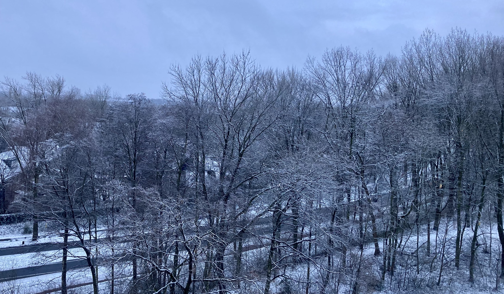

本篇是对`2024-01-14` 到 `2024-01-20` 这周生活的记录与思考。

## ❄️ 初雪

荷兰今年的冬天并没有很冷，之前经历的为数不多的小雪都无法形成积雪，本以为 24 年已经看不到雪了，但有天早上拉开窗帘，惊喜地发现外面已经一片洁白。冬季呼啸的寒风将大片的雪花吹散，天地之间弥漫着模糊的白色，而自己，在温暖的屋子中打开了 lo-fi 。

想到自己在国内离开北方后，有好一段时间都没有看到过大雪了。还记得小时候，会和小伙伴在家门前的偶尔结冰的小陡坡上滑来滑去，有时，还会在上面泼水以加快结冰，但这样却让出行的大人叫苦不迭。到了高中，记得有次自习课上，当大家都在埋头做题的时候，窗外突然传来了轻微的撞击声，当我从枯燥的文字中抬起头时，就看到寒风裹挟着大片的雪花撞击着窗户，再往远处看，世界已经变得近乎洁白。此时，原本寂静的教室中，传来一声不约而同的赞叹。

## 拒绝后的松弛感

长久以来，自己好像一直不知道怎么拒绝别人。这里拒绝，是指在自己的想法和他人的期望出现不一致时，自己会倾向于妥协自己，满足他人的期望。在“讨好型人格”成为一个泛滥的标签是，我却很少会将自己的这种心态归于这样的原因，因为多数情况，自己只是觉得自己可以很有效率地帮助别人解决问题，并不会花费很多时间成本，所以在多数情况下，倾向于回答‘Yes.’

然而，随着学习的进行，自己逐渐发现时间的稀缺，在这样的背景下，我重新思考了新学期是否还要继续参加此前加入的校园咨询组织。当初，自己是抱着利用既有知识和练习英语的目标加入这个组织，在整个过程中，自己确实实现了之前的目标，但是，一周两次的晚间冗长会议让我有些难以适从，而且综合看来，自己在整个过程中并没有遇到太多挑战，因此除了英语口语之外，并没有太多的成长。

于是这一周，自己尝试做了一些转变。

这周周中，当我在健身房时，收到了资讯组织负责人的短信，询问我下学期是否还想继续留在这里。我在跑步机上纠结了很久，而一想到自己早期还表达了想继续留在这里的意愿，让自己更难拒绝。但是，随后自己就在多轮的实习投递经历中，发现需要学习的领域还很多，时间和精力将成为未来很重要的资源，而且，自己也需要更多的时间去让生活松弛一些，因此，拒绝成为了更适合当下情况的选择。于是，自己在晚上回去后，按照邮件的格式，写了一封正式的拒绝回信，表达了自己的理由，同时争取他人的理解。

在对方第二天表达了理解，尘埃落定后，自己也从过去一段时间，在思考未来一年规划时的纠结中走出，有了种奇妙的松弛感。

## 英语的瓶颈期

之前学习吉他的时候，就有碰到瓶颈期的情况。在刚学吉他的时候，自己总是苦于换和弦时的笨拙，后来一位朋友告诉我一直练就可以了，没有其他的方法。于是，自己听从了他的建议，一次次重复着练习，直到有一天，自己突然可以从 C 和弦换到了 Am 和弦，然后又可以顺利地在 E 和弦和 G 和弦 之间切换，这种突然掌握技能的经验，让我欣喜不已。同时，这段经历也让我意识到在学习某项技能遇到瓶颈期时，可能不管自己怎么努力，都看不到明显进展，但是这种时候，还是需要继续坚持，点滴的积累，最终才有可能产生改变。

这次英语口语学习的经历也是类似，从到了荷兰之后，就尽量把握每一个能使用英语的机会，然而进展缓慢，自己在用英语口语时还是会存在因为紧张而语速过快，影响正常表达的情况。不过自己还是脸皮很厚地一直在练习用英语在各个场合表达，犯错然后改进，并逐渐摆脱在口语中对 'Grammatically perfect’ 的执念。在这个过程中，自己对英语的态度，也从‘学英语’逐渐转变到‘用英语’，从所谓‘标准’的英语中摆脱，走入到日常生活的场景中，基于更好地表达自己的目的去运用英语。

这周四到阿姆参加了一家公司的实习面试，虽然结果不尽如人意，但是整个过程中，我突然发现自己的英语口语好像一下子流利了很多，基本可以用现有的词汇，完整表达自己的意思，英语口语的瓶颈期，似乎悄无声息地过去了。

想到 [Everything sucks](https://medium.com/thought-pills/everything-sucks-cbca5b55c855) 这篇文章中所说：

> Your first 100 blog posts will suck.\
> Your first 5 books will suck. \
> Your first 30 talks in public will suck. \
> Your first 50 paintings will suck. \
> Your first 100 songs will suck. \
> Your first 40 YouTube videos will suck. \
> Yes, I made all of those numbers up. \
> And it doesn’t matter. \
> What matters is to understand that <u>you’ll suck at everything in the beginning.</u>

## 实习

### 面试

上周去阿姆面试了一家做虚拟货币的对冲基金，虽然在面试聊得还挺不错，但是在这周还是收到了拒信。我反思了一下整个过程，发现了 2 点之后可以改进的地方

1. 找工作本质是一个销售的过程，而销售的重点是需求匹配，自己在能力符合要求的同时，要从对方的需求出发，体现出自己的能力，并体现出自己能力和职位的匹配。这次面试中，虽然对方很认可自己的简历，但是在面试中，自己过于强调 Technical Skills，忽略了金融技能方面的讨论，而后者，可能才是对方真正需要的基础技能。FinTech 中，需要选择一个方面作为自己的重点，另一个当成一个 Plus。

2. 在面试技巧上，也要主动展示自己相关的经验和能力。这次面试我的并不是专门的 HR，和这些业务人员交流时，他们的话题的出发点可能并不是尽力发掘你的能力和潜力，这种时候，自己就要在交流时多举实际的例子，展示自己相关的能力。

### Online Assessment

上周还做了一家投资公司的 online assessment，算是目前为止难度最高的了。

1. 在 Coding Questions 中，遇到了 Recursion 和 [Approximation algorithm](https://en.wikipedia.org/wiki/Approximation_algorithm) 的问题。Recursion 自己一知半解，Approximation algorithm 自己之前则是从未研究过，之后需要再学习下。
   之前自己还以为做 Data Science 不需要再刷算法题了，现在看来，还是有这种必要的，一方面是更好地思考代码效率问题，另一方面则是太长时间不写代码手也会生。

2. 自己本来以为很擅长的 Numerical reasoning test，也遇到了很大的阻力，题目最后都没有完成。不过我觉得主要是因为自己了解的解题方法太少了，思维总是局限于少量的可能性，所以在无谓的尝试中浪费了很多时间。之后可以总结下相关的题目的主要思路，应该会是一个很容易提高的领域。

3. 在 Probability Theory部分，自己在计算 Expected Value 上会遇到一些问题，一是理解题目的速度上，二是找到合适的计算方法。之后在之后需要多了解一下除了正态分布之外的其他分布，并要从实际的例子中去理解和运用。

## 阅读

这周看完了 [献给名侦探的甜美死亡](https://www.douban.com/doubanapp/dispatch?uri=/book/36316842)。很欣赏作者方丈贵惠将 VR 和传统本格推理相结合的探索，书中既有本格推理中最经典的密室杀人，也有老派的 “挑战读者” 章节。既然是本格推理，就要保证对读者的公平，在文本中巧妙地埋下经得起事后验证线索；另一方面，还要充分利用环境的设置，创造一个个 “不可能” 的密室杀人。在此方面，就体现了方丈贵惠驾驭自己创造的世界的能力。书中的每一个案件都合理且充分的利用了所处世界的特殊设定，并变化出了多种的作案手法。因此，阅读本书的体验是很新奇的，当你尝试用前一个案件的手法去思考当前谜题时，作者会用更为大胆的解答挑战你想象力的边界。

对我而言，书中不足的地方主要有两处：

1.人物刻画。本书人物众多但刻画不够深刻，多数人物带着相似的“中二”特质，他们的性格对读者而言，没有行程足够的印象点，这点会对理解剧情造成负担。

2.动机描述。虽然和社会派相比，本格派更注重精巧的犯案手法，但是本书的作案动机仍然略显简单，甚至有些幼稚，很难让人相信可以支撑起这样煞费苦心，规模巨大的犯罪。

## Weekly Gems

### Data Science

- Recursion 算法的介绍 [Recursion in Python: An Introduction](https://realpython.com/python-recursion/)

- [Dive into Deep Learning](https://d2l.ai/chapter_preface/index.html) 在 “Learning by Doing” 的概念下，提供了 Deep Learning 的学习路线

- 

- [Data-and-ML-Projects-](https://github.com/Coder-World04/Data-and-ML-Projects-) 提供了 Data Analytics、Data Science 和 Machine Learning Projects ，自己学习后可以放在 portfolio 中。

- [How to Schedule & Automatically Run Python Code!](https://morioh.com/redirect?id=5fc114881a53c42123414989&own=6041d86d402ecb2186936c39&l=https%3A%2F%2Fwww.youtube.com%2Fwatch%3Fv%3DaqnJvXOIr6g) 这篇教程讲解了如何在定时运行 Python Scripts，对于之后部署爬虫或做量化交易应该会很有帮助。

### Career

- [HackerRank](https://www.hackerrank.com) 是一个类似 leetcode 的网站，这个网站提供了题目、[认证](https://www.hackerrank.com/skills-verification)和[工作职位](https://www.hackerrank.com/apply)，一些公司会选择在这里创建 online assessment。

- [Financial Study association Amsterdam](https://fsa.nl/jobs/?fwp_job_type=internship) 提供了荷兰金融领域内的实习机会。

### Pixel Art

像素画中的大团云朵总是有种特殊的魅力，自己之前在 Aseprite 中尝试了但总是不得要领，看到这个推文感觉自己眼睛已经会了，之后上手看看👀



## 图书

- [《洛阳大火》](https://book.douban.com/subject/36384743/)可以弥补我对后汉史的一无所知，而且也可以了解洛阳这个城市的历史。

- [《陶偶》](https://book.douban.com/subject/11597370/)
是一部空间物理博士写的科幻小说，其中为真人复制陶偶的设定很吸引我，很好奇作者将会怎样展开这样一个故事。
