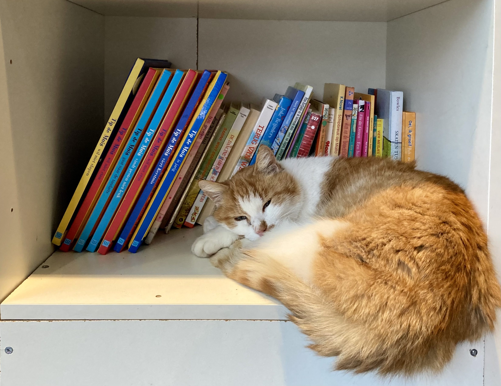

<iframe
	style='border-radius:12px'
	src='https://open.spotify.com/embed/track/6gI8gTacAsGPEy70QK4a3i?utm_source=generator'
	width='100%'
	height='152'
	frameBorder='0'
	allowfullscreen=''
	allow='autoplay; clipboard-write; encrypted-media; fullscreen; picture-in-picture'
	loading='lazy'
></iframe>

本篇是对`2024-01-28` 到 `2024-02-03` 这周生活的记录与思考。

## 回到马孔多

去年下半年，读书群的朋友们在读完了《暗淡蓝点》后，选择共读《百年孤独》。上周日，分布三大洲的我们终于凑出时间，在线上开了分享会。

我的阅读体验在本书中段时渐入佳境，但可惜遇上期末考试，读书只得搁置一边。然而，考后重拾时，书中的人名让我有些无所适从，并多次重读失败，虽然最后仍然读完了整本书，但是仍因为这样的小波折，留有遗憾。于是也想在这次读书会上，听一下其他书友的所得。

之后书友们谈及了读这本书的一种困境：当我们读书时，我们在期望读完后获得什么？尤其是读类似《百年孤独》这样的名著，如果我们不去结合哥伦比亚的历史去读，是否算是一种遗憾。回想下，这也是我之前所面临的一种困境，当我准备读一本经典名著时，我总会有自己还没有准备好的感觉：一开始会想要做背景功课，接下来又因为要做这些功课，而一直拖延不能真正翻开书本。其中一位书友的回答很有启发，她提及了一种挂毯，人可以从不同的角度、远近和明暗去观赏，并获得不同的审美体验；读书也是类似，**书本的入口和出口都是开放的**，我们作为读者，有选择入口的自由，也有选择出口的自由，很多图书（包括《百年孤独》），即使作为一本纯的故事集，也是有趣的。

她启发我思考读书所谓的“功利性”，当我们太希望从名著中获得迥然不同的审美体验时，结果往往适得其反。我们应该对这些书本有信心，也对作者有信心，抱着一种更加平和的心态去和书本互动，由共鸣产生的私人化的体验，才是读书过程中最珍贵的。而时刻等待着被取悦、被教育或被惊喜，这种心态和刷社交媒体的状态其实并无二致，想到李昌镐在他的自传《不得贪胜》中说，真正享受围棋乐趣的，反而是对胜负和其背后奖金没有执念的业余选手。

回想起来，自己此前对名著的胆怯，在去年和书友共读《巴黎圣母院》时被逐渐消解，虽然我直到现在也没有对雨果先生笔下的巴黎历史有更为深入的了解，但是芳汀之死依然能让我产生一种悲悯。

另外，当讨论《百年孤独》时，很难忽略这本书中角色的同名，当我们一起吐槽这个事情的时候，获得了读书的另一种快乐。

## 去往柏林

去年在厦门一起吃姜母鸭的大学同学，发消息说他要来柏林参加展会，高兴之余，想着正好和熊小花在情人节后一起出去逛一逛。

想想自己对柏林的了解，似乎全部来自于二战。在《战争中没有女性》这本书中，阿列克谢耶维奇转述了一位苏联女兵的故事，她和他的男友在列宁格勒保卫战中共同战斗，然后开着坦克一路平推到了柏林，并将两人的誓言写在了柏林国会大厦。甚至在和熊小花提议这个行程的时候，突然看到了床头理想国的《档案：一部个人史》，作者尝试在史塔西的监控笔记中，回顾自己在东德的生活，这次过去希望去看下史塔西博物馆和曾经的柏林墙。

这次还可以赶上第 74 届柏林电影节，具体的片单我们还没有看，看有没有时间过去感受下现场的氛围。还记得在第 64 届柏林电影节上，《布达佩斯大饭店》、《白日焰火》和《推拿》竞逐金熊奖，最后刁亦 男导演的《白日焰火》一举夺魁。

## 奇妙的连接

某天感受到的某种被连接的时刻是，当我在听着 Sparkle 时，在查询作者 山下达郎 的 wiki 时，发现他的妻子是唱了 Plastic Love 的竹内玛利亚。这两个都是我很喜欢的音乐家，虽然他们的风格稍显不同，山下达郎的风格更加热烈，竹内玛利亚则带有 city pop 中美好的怀旧，但在 baseline 上，他们两人歌曲中的编排都相当惊艳，在 山下达郎 的 Sparkle 和 Ride On Time ，竹内玛利亚的 Plastic Love 和 夢の続き 中， 密集铺陈的 bass 的一直引领着歌曲的 rhythm，但恰到好处的休止既提供了丰富的律动，还让 bass 不会抢戏，给了 melody 足够的发挥空间。这两个人都间接影响了我从吉他转向贝斯（aka Kings of Rhythm），而且更加奇妙的是，我的贝斯在寒假前因为拾音器脱焊无法正常向音响输出音频，我上周在上面这种连接的恍惚感中，竟然一顿操作把贝斯修好了 😆 之后又可以在家随手弹弹棉花。

## 时间的回响

没有想到有一天竟然会被自己治愈。

我习惯用 logseq 记录每日的笔记，并建立了一个晨间日记的模版，当我开始写本周的 reflection ，输入上周开始日期的时候，突然发现在一年前 2023年1月28日，自己还有一条笔记，自己好奇地点开看，发现了这样的记录：

> 完成了 Headspace Basic 冥想课程中的第一节。时隔很久再次冥想，感觉自己的专注和对想法的控制已经不如从前，当然自己的脑子最近很乱也是其中一个原因。
>
> 第一次冥想中，我随意游荡的注意力错过了闭眼睛的提示，睁着眼睛进行后续的练习。第二次冥想也是错过了闭眼的提示，自己通过进度条找到了闭眼的节点。之后觉察身体的过程中，自己也很不专注，脑子一直在想工作的事情，虽然我很确定，明年这个时候，我就会把这些事情基本忘掉。
>
> 第一次冥想结束，自己还是获得了一些 headspace，可以暂时从思绪的漩涡中抽离。这时我突然注意到，冬日阳光打在我身旁的衣柜上，看起来非常柔和，是崭新一天中的柔和。

"虽然我很确定，明年这个时候，我就会把这些事情基本忘掉。"，到了现在，我自证了自己的预言，完全记不清当时看起来相当困扰自己的事情，究竟是什么了 :)

在这样穿越时空的自我对话中中，我感觉自己目前在学业和事业上遇到的困难，都被消解掉了。

这件事情也让我思考记录的力量。

这是我的第 5 篇 weekly reflection。坦诚来讲，当我在去年设立这个目标时，自己甚至都没有想到会走这么远。在每周坐在电脑前回顾过去一周的时候，我最先感受到的反而是遗忘的力量，在这样短短一周的时间内，太多的事情和情感已经因为遗忘失去了细节，留下一个个被虚空侵占的时间碎片，成为了一个巨大的问号。我习惯于在新一天的早上回顾前一天，有时因为时间来不及，也会漏掉改天的记录。当我想在第二天重新记录被跳过的这一天时，惊觉过去的一天已经面目模糊，自己又是怎样略显徒劳地想用文字追溯记忆。这个场景，有些类似陷入失眠的马孔多。

在这 5 周中，自己在记录上的努力逐渐促进自己生活的微小转变。这有些类似于当你总是带着一个相机出门，你会更容易留意到自己周遭的景观，即使在一天内你并没有拍到满意的照片，但这种觉察的转变，仍为你提供了一种和周围主动互动的新方式。和摄影又不同的是，这种更偏私人的记录，一方面没有统一的规范，另一方面也不存在被人打量的可能，所以自己能更加诚实且中性地看待周围的事情，并将其记录。这样看来，记录本身也是一个冥想的过程。这样的体验让我想到 Notion 官网上的一句话：

> We shape our tools and thereafter our tools shape us. -- Marshall McLuhan

## Data Science

上周参加了学校的 Best Thesis Symposium ，认识了一位做 portfolio optimization 的同学，和他交流了数据集的情况，他好心地和我分享了 time-series 的学习资料，还有数据源 [Fred](https://fred.stlouisfed.org/) 和 [CRSP](https://www.crsp.org/research/)。

同时，另一位同学的论文让我了解到了 XAI (eXplainable AI) 这个新概念，对我启发很大，这个方向可以帮助理解 machine learning model 并尝试解决其中的黑箱问题，一方面，unknown risks are more dangerous than known risks，这在 financial risk management 中更是如此，风控模型倾向于低估黑天鹅事件所代表的 tail risk ；另一方面，这个方向可以解决黑箱背后的算法歧视(Algorithmic discrimination)问题，比如算法将性别、宗教信仰、基因信息等因素作为模型输出结果的重要考量，XAI 可以帮助组织更好地理解自己在业务中使用的模型，以降低合规风险。

## Django! Django!

这周收到了 Manning Publication 送来的惊喜。

在上上周完成了 《[Django in Action](https://www.manning.com/books/django-in-action?a_aid=celqaz&a_cid=300c6801)》的手稿审阅后，想着终于结束了一段工作，可以多出时间准备学业，就忘记了这件事情。然后就在周中，收到了 Manning Publication 的邮件，告知因为自己之前的工作，可以选择一份奖励，一是这本书的电子版和价值 $50 的 token，另一个是纸质版图书。虽然纸质版图书更有纪念意义，但是由于图书还未正式出版，预计还需要 4 - 6 周才能拿到纸质书，所以我还是选择了拿电子版图书。

作为一个平常喜欢翻翻书的人，这次参与到了图书的出版过程，这样一个小小的角色转变自己还是很开心的。



## 阅读

这周在 《Chip War》中看到了芯片在民用市场和军用市场的拓展。

民用市场上，索尼 "licence it" 的策略让其利用 Texas Instruments 和美国公司的成熟量产技术，并结合其产品设计能力，在民用消费电子产品领域异军突起；反观苏联，其 ‘copy it’ 的策略无法跟上摩尔定律下突飞猛进的芯片工艺，另一方面，臃肿的机构和低效的资源配置能力也难让企业家发起创新，没有出现美国芯片产业中的“群星闪耀时”，例如这时，Bob Noyce 和 Gordon Moore 从 Fairchild Semiconductor 出走，创立了 Intel (INTegrated ELectronics)， 并民用内存(DRAM) 上赚到了这家新公司的第一桶金。

军用市场上，彼时在深陷越南战争泥沼的美国，如何更提升导弹准确性成为五角大楼的重要议题，而这为 Texas Instruments 带来了军用品的订单，这些订单中诞生的装备芯片的精准打击武器，不仅为美国的芯片产业链带来了资金，还让苏联加入到这场依托于芯片的竞赛中。

## Weekly Gems

### 读书

    <Douban
        src={'https://img1.doubanio.com/view/subject/l/public/s34522268.jpg'}
        caption={'我在北京送快递'}
    />
    

        [《我在北京送快递》](https://book.douban.com/subject/36150423/)是这本书我在“文化有限”的播客上听到的。我对内容非常喜欢。之前看书名，我以为是纪实类的书，但是听了内容发现作者胡安焉在进行更为正式的文学创作，他会在快递的工作中思考文学，思考《麦田中的守望者》带给他的感动，也和伍尔夫女士产生共情，还关心人作为一个个体，他/她 的心理景观，这些我曾以为需要在闲适生活中产生的思考，没想到也可以在奔波的生活中茁壮生长，于是就让我想象，我们可以过一种怎样的精神生活。

        一个有意思的细节是，胡安焉是作者王计兵的笔名，”胡“、“安”、“焉” 都是文言文中表示疑问的代词：

        - 胡：《归去来兮辞》：“田园将芜，胡不归?”
        - 安：《陈涉世家》：“燕雀安知鸿鹄之志哉？”
        - 焉：不入虎穴，焉得虎子

        王计兵用这三个字作为笔名，很准确地传达了生活本身的不稳定感。

        <iframe style="border-radius:12px" src="https://open.spotify.com/embed/episode/7hr1EzSsRR9wszT4PbuEIV?utm_source=generator&t=0" width="100%" height="152" frameBorder="0" allowfullscreen="" allow="autoplay; clipboard-write; encrypted-media; fullscreen; picture-in-picture" loading="lazy"></iframe>

    

	<Douban
		src={'https://img1.doubanio.com/view/subject/l/public/s28340848.jpg'}
		caption={'An Introduction to Statistical Learning'}
	/>
	

		[An Introduction to Statistical Learning](https://www.statlearning.com/)
		是新学期学习课程的参考书目之一，在 Data Science
		中，统计学还是绕不开的主题，这次准备好好学习一下。
		
	

### 语言学习

- [migaku](https://www.migaku.com/signup?code=r1NVDnCfHGaDCxTaCDvzPo8UNGp2)

没想到上周被荷兰人教了如何学日语 😓 他作为一位喜欢日漫的人，学习了日语并去日本做了交换生，他用这个网站的插件将日漫的视频导成带有原声的 Anki 卡片，并向我强烈推荐。

- [vidanki](https://vidanki.com/)

vidanki 是另一个 Anki 制卡的应用，可以读取 youtube 视频的原声，并制作成 Anki 卡片以供学习。我准备将这个软件用于自己之后的英语学习上。

### coding

- Google 推出了 关于 machine learning 从基础到进阶的[在线免费课程](https://developers.google.com/machine-learning/foundational-courses)

- 🦀 [comprehensive-rust](https://github.com/google/comprehensive-rust) 是 Google Android 团队推出的一个学习 Rust 的课程，看到这个教程互动性很好，于是收藏了下

### 杂项

- [40 questions](https://github.com/kepano/40-questions/tree/master?tab=readme-ov-file) 是 Obsidian CEO Steph Ango 用于年度回顾的问题，我想之后可以用来组织自己 2023 年的总结上。

- [gwern.net](https://gwern.net/index) 是 Gwern Branwen 的博客网站，此前我对这个人一无所知，但是通过奇妙的互联网，我发现了他这样一个样式优雅，内容有趣的网站，很喜欢他放在 Me 页面下的一句引用

> The reader lives faster than life, the writer lives slower. -- James Richardson, [“Even More Aphorisms and Ten-Second Essays from Vectors 3.0”](https://gwern.net/doc/philosophy/2010-richardson-bythenumbers-vectors30)
