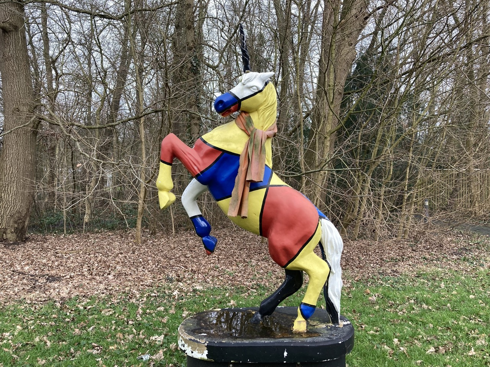
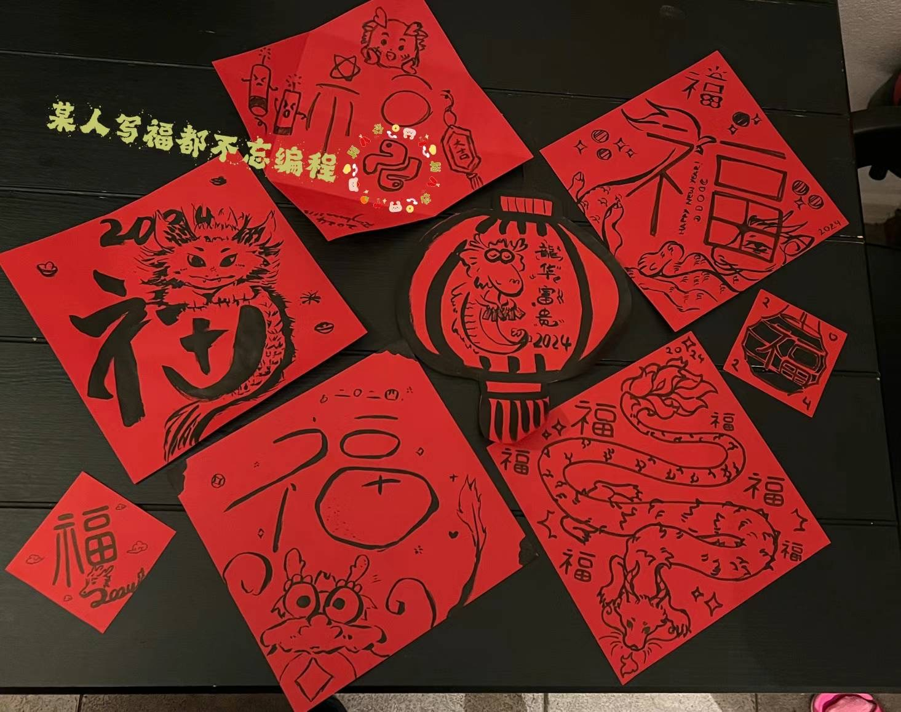

+++
author = "Bin Li"
title = "Weekly Reflection 24#6: 异国新年"
date = "2024-02-13"
description = "2024 年第 6 周的回顾与反思"
tags = [
    "Weekly Reflection",
]
+++

本篇是对`2024-02-04` 到 `2024-02-10` 这周生活的记录与思考。 

## 春节中的家人

这周是农历新年，也是自己没能和家人过的第一个春节。本来想早早地给家人打电话的，但除夕前一天自己并没有睡很好，下午补了个觉就到北京时间晚上 11 点了，和家人聊了聊天，然后就开始准备自己的年夜饭。

在聊天的时候，发现自己和父母一直沟通的似乎都是同样的话题：睡眠怎么样、身体有没有不舒服、有没有多吃点蔬菜水果 ... 诸如此类。之前因为快节奏的工作，自己好像没有注意到这个问题，但因为出国自己有了更多的时间，也可以感受到这种变化。仔细想想，好像自己和父母的沟通其实都处于一种 “不报忧” 的模式中，而且对方也知道自己这种状况，但又不知道怎么谈论。好像从上大学离家之后，自己就很少向家人说自己遇到的困难，家人也想象自己工作辛苦，所以不想再说自己遇到的一些问题。在家人看来，自己的生活或许是一片模糊的空白吧，想到在《请回答 1988》中，罗美兰对狗焕说，”妈妈希望了解你的所有事。“，今年，自己或许也能做出一些改变，邀请父母进入自己的生活。

挂完电话的时候，突然想到去年过年的时候，爸爸说到，要是我今年出去，明年过年就不能一起了，然后家中突然沉默了一会儿。

## 荷兰的年夜饭

之前组织了公寓的朋友一起做饭，当我们在准备做饭，差不多可以吃的时候，邀请的罗马尼亚室友还没有到家，后来她匆匆赶回，才告诉我她以为春节晚上要到午夜才吃晚饭 😂 所以准备等到更完一些再回来做饭。这种理解的偏差还到了着装上，她不知道从哪边看到的春节习俗，特意早上穿了绿色的衣服，晚上穿了红色的衣服，结果她成为了整个屋子中唯一穿红色的人。

年夜饭我和熊小花两个人都莫名其妙地有些小翻车。晚饭我本来想做鱼香肉丝，但是由于早上没睡醒，没有看到菜单配料表中的豆瓣酱，在做饭的时候只能用辣椒油炒个红油，最后还是少了核心的味道，有些可惜。熊小花之后做的糯米鸡，我们没能在这边中超买到荷叶，于是用了芭蕉叶代替，但是她在最后蒸的时候忘记加盐和生抽了，所以并没有太入味，不过整体味道还不错。

年夜饭后我们玩了 Splendor ，大家在一局后就熟悉了规则，之后随着游戏节奏加快，大家玩得也很投入。在第三把游戏结束后，我们才意识到已经过了午夜，在大家声声的 happy new year 中，我们进入了新年。

熊小花拿出来在今天在车站附近买的红纸，和大家一起写了“福”字，我画完一个已经困的不行，但是他们都还是很有兴致，最后将红纸都快画完了：

## 准备不足的面试

这周面试了 UPS 的 Data Science Internship，意识到了自己的在技术的覆盖面上仍有不足，主要主要：

- Linear Regression Model: 非常基础的模型，自己一直在听说，但是没能转化为实际应用。这部分刚好这是自己这学期课程包含的内容，之后可以进行下学习的总结，并研究下其他的模型。
- CI / CD: 自己对这部分的了解主要来自于与 GitHub Actions，但没有实际应用过。回想下，自己确实在很多 Data Science 相关的职位中看到过这个要求，之后还是要学习下。
- Big Data: 需要熟悉下处理大数据的企业级应用，如 BigQuery
- Cloud: 云端服务的经验，自己之前在 Umedy 上买了 AWS Certified Solutions Architect Associate 的课程，不过一直没有继续，这次也是个重启学习的机会。

综合看来，这部分的短板主要由于自己在学习完新的技术后，缺乏在项目中应用的经验，因此之后准备建立在自己的 portfolio，并及时将自己所学的知识，转换为可见的项目应用，这似乎也可以同时跳出 tutorial hell。

## 一周的电量焦虑

上周的回家时，将电脑充电器忘在了熊小花的家中，于是这一周都在电量焦虑中度过。这周频频关注电量的体验，也让我思考自己和电子产品的关系。自己在电量不足，将电脑关机后，似乎才一下子回到了现实生活中：在以往，自己总能在互联网上找到新鲜的事物：新的 Data Science 教程、新的实习岗位、新一期的播客、新出版的图书... 自己也在一种由于担心落后而产生的囤积综合症中，疲惫地追逐着这些事物，但是这次断电断网让自己突然回归了生活，更加关注于自己，而非外在，并体验到一种更真实的自由。

## 阅读

这周开了《古拉格群岛》。

在开这本书之前，我本以为会读到满篇声泪俱下的控诉，但第一章的“逮捕”却写得十分诙谐。“逮捕”这样一个组织强行施加于个体行为往往代表着威权的强力，并应该是一个严肃的过程，但索尔仁尼琴却将其拆解，让读者看到这个过程中的随意和魔幻。索尔仁尼琴并没有用夸张的描写手法，他只是描述足够荒谬的现实，就已经让文本产生了讽刺的效果。

## Weekly Gems

### Code

- [MoneyPrinter](https://github.com/FujiwaraChoki/MoneyPrinter) 是上周 Github Trending 项目，调取 GPT、免费图片和免费视频的API，并通过 MoviePy 生成短视频，我调试了一下，是可以生成视频的，但是视频质量一般。作者调用并整合 API 的思路还是值得学习的，之后准备阅读下源码，看看各个组件功能的具体实现。

- [Python For Finance](https://www.youtube.com/playlist?list=PLzwwb1xQjioN4VRl-sFbfFWARlT29ZzZt) 是一个讲解 Python 在金融中应用的视频合集，对于自己未来 thesis 的写作会有帮助，并且也可以放在自己的 portfolio 中。

### 播客

很早之前就看了《强风吹拂》，时隔多年已经印象模糊，这次在做饭的时候重听播客，突然又被“燃”到，尤其是听到参加箱根驿传的选手，会由于无法将接力带传给自己的伙伴而崩溃大哭。今年准备重读，也希望这本书可以支持自己继续跑步。

