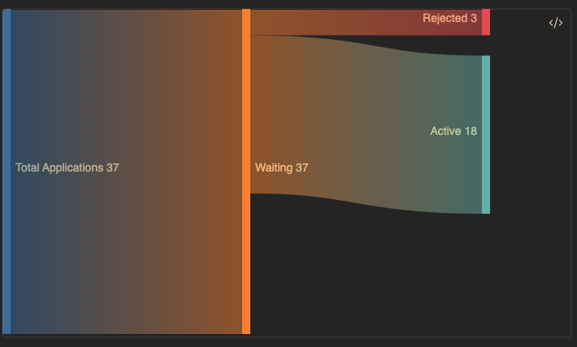

本篇是对 2025-01-05 到 2025-01-11 这周生活的记录与思考。

## Job Hunting

这一周基本是围绕着找工作展开的。为了追踪申请的职位，我仿着在 GitHub 上看到的[模版](https://github.com/universvm/obsidian-job-dashboard)，在 Obsidian 上建立了一个追踪申请进度的页面，顺便还学了下用 dataview 做下数据的可视化。这一周体验下来，觉得自己还是更适合这种可以量化标准的任务。相较于之前定的宽泛的“投工作”的任务，自己现在会定下“每天投 X 个职位” 的更为具体的目标，而且每天投完看着更新后的 Sankey Diagram，自己也会收获即时的反馈。

这一周，自己投工作的策略也有一些更新，之前我会专注于 finance analyst 方向的岗位，但是投了一些自己感觉匹配度比较高的职位，但是直接被拒了，于是我想投一投 tech 属性更强的岗位。这周开始，我就更新了一版更和 data 相关的简历，主要是删去了课外活动的 section，增加了自己之前做的 project，顺便附上了相关的链接。在投了一些后，我发现 HR 开始点击我的 GitHub，但我的 profile 很久都没有更新了，于是我又从 [Awesome GitHub Profile README](https://github.com/abhisheknaiidu/awesome-github-profile-readme) 上找了一些 code snippets，紧急修复了一下，还顺手更新了一下 LinkedIn，这次的经验就是，profile 日常还是需要经常维护。

## 生日

这周迎来了自己的生日，我记得去年，熊小花 找人做了一个蛋糕，我们在小房间里一起庆祝了一下，当时自己也处在找实习和新学年的不确定性之中，还有妈妈一直说我饿得太瘦了，要多吃一些。今年，我们搬进了更大的房子、认识了新的朋友、有了新的爱好、两个人在一起也都好好吃饭、也在年终顺利完成了学业，到了人生新的阶段。但可能是读完 Master 的尘埃落定，让自己依然有些恍惚，再加上未来的不确定性，自己并没有太多期待这个生日，只想早点把工作搞定，也因为如此，熊小花 一直问我生日想要什么，我也一直没有细想，这个就留到以后吧。

之前在国内的时候，由于工作的原因，很多情况下都是一个人过生日，自己也没有太在乎。这次，熊小花 正好和朋友一起来家里吃饭，她还是说漏嘴了让朋友们知道了，于是自己还是过了一个有蛋糕的生日，突然想起来，上次在生日时吃蛋糕，都不知道是什么时候了。

这次生日，自己也收到了爸爸妈妈的祝福，自己也表达了对他们的爱和做他们的孩子很幸福，感觉自己可以表达这样的感情是一种很大的进步，这才是真正的成长吧。

## 读书

这周继续读了《尘埃落定》，“我”作为一个“傻子”，对周遭的一切事物都没有依恋，于是他的视角就成了一个客观的叙述者视角，于是任何魔幻或不顺，在他的平铺直叙下，都成了一种可以接受的现实，主人公不加情绪的叙述，给读者留给很多想象的留白，还反而给书中的人物增加了很多戏剧冲突，因为“傻子”的行动和言语总是让人难以预料，当聪明人在“傻子”面前吃瘪，总是让人会心一笑。当自己觉得看得精彩之时，再看下才看了不到 50% 时，于是就有了新的喜悦。另外一个发现是，当读书的进度超过 60% 时，就会读得飞快。

这周由于找工作的原因，发现自己好久没写代码了。接下来想读一本 Fluent Python，系统了解下 Python 的机制，以及如何写出 robust & elegant 的代码。

## Weekly Gems

这周晚上和熊小花吃饭的时候看了两个印象很深的演讲，

[【一席】骆以军：旅途中的陌生人](https://www.youtube.com/watch?v=CpYyF55BwoE)
讲者是一位台湾人，在广州白云机场等飞机的时候，看到一个僧人说他面向很好，想要和他结个善缘，他本来以为是骗子，但是转过头却发现那个人像他过世 10 年的父亲。他后来总结说，离去的人可能会以另外一种面貌再此出现，虽然他们已经忘记了前世的记忆。

[【一席】陈晓楠：本故事纯属虚构](https://www.youtube.com/watch?v=unQJyn4Mzg4)
这里分享的关于间谍的故事，曾经的间谍在出狱年老时，还在怀揣自己喜欢的女生的老公过世的信念活着， 这让我和熊小花笑得停不下来。那时，我也意识到，自己已经很久没有大声地笑出来了。
