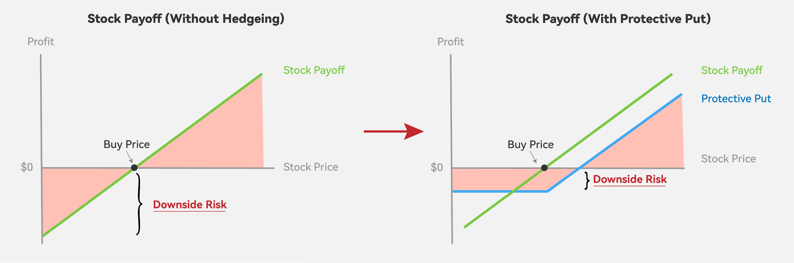
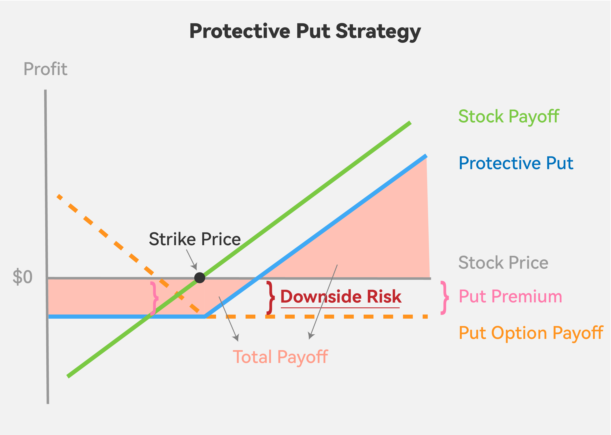

Photo by <a href="https://unsplash.com/@markusspiske?utm_content=creditCopyText&utm_medium=referral&utm_source=unsplash">Markus Spiske</a> on <a href="https://unsplash.com/photos/black-android-smartphone-displaying-white-screen-nOv3mUv3mvA?utm_content=creditCopyText&utm_medium=referral&utm_source=unsplash">Unsplash</a>

In the unpredictable world of financial markets, investors often seek strategies to protect their portfolios from potential downturns. One approach to managing downside risk is through the use of options. By employing various options strategies, investors can hedge against potential losses in their portfolios if the market experiences a decline.

Among all the options strategies, protective put is an easy-to-construct yet effective way to hedge market downside risk while participating in the market's potential upside. This article will explore how to construct a protective put, providing an overview of this strategy and its potential strengths and weaknesses.

## Introduction to Protective Put

A protective put is constructed by:

- Holding a long position in the underlying security and
- Buying a put option;

The basic idea is when the stock price falls under the strike price, the put option's increasing value will hedge our loss; cause you have the right to sell the stock at a higher price(strike price).

As the stock price drops, so do our stock returns. However, the value of our put option increases correspondingly, hedging the downside risk and protecting us with a floor loss.

Hence, as shown in the diagram below, your ultimate payoff(blue line) is the combination of the payoff on the stock(green line) and the put option(orange dotted line).

## Explain with Example

Let's illustrate this strategy with an example. To simplify the calculation, we do not take transaction costs into account.

Suppose we buy one share of Apple's stock at $190; we want to mitigate the downside risk and implement the protective put strategy by buying a put option on Apple's stock for $2 with a strike price of $190.

| Symbol                           | AAPL    |
| -------------------------------- | ------- |
| Buy Price of Stock               | $190.00 |
| Cost of Put Option (Put Premium) | $2.00   |
| Strike Price                     | $190.00 |

- When the stock price falls under the strike price

  Let's say the stock price falls to \$180. In this situation:

  - our payoff from the stock is $\\$180 - \\$190 = -\\$10$
  - our payoff from the put option is $Max(\\$190 - \\$180, 0) - \\$2 = \\$8$
  - the total payoff is $-\\$10 +  \\$8 = -\\$2$

  By doing so, we successfully limit our potential loss to -$2, which is the cost of the put option, aka put premium. In fact, our loss will be limited to $2 regardless of how much the underlying stock price falls.

- When the stock price rises above the strike price

  Suppose the stock price rises to \$191. In this situation:

  - the payoff from the stock is $\\$191 - \\$190 = \\$1$
  - the payoff from the put option is $Max(\\$190 - \\$191, 0) - \\$2 = -\\$2$
  - the total payoff is $\\$1 -  \\$2 = -\\$1$

  Notice that even if the current stock price is higher than our previous buy price, we're still losing money due to the put option's cost. In fact, we can only gain once the current stock price is greater than the sum of the buy price and the put premium. In other words, our break-even point in this situation is 190 + 2 = \$192.

  Assuming the stock price continues to rise to \$200. In this scenario, our return is calculated as follows:

  - the payoff from the stock is $\\$200 - \\$190 = \\$10$
  - the payoff from the put option is $Max(\\$190 - \\$200, 0) - \\$2 = -\\$2$
  - the total payoff is $\\$10 -  \\$2 = \\$8$

  We can still profit from the increase in stock price.

## Strengthens and Weakness

Strengthens:

- Downside Protection

  The Protective Put strategy allows investors to limit potential losses in the event of a market decline or a drop in the underlying asset's value while still benefiting from market upsides.

- Simplicity

  The Protective Put strategy is relatively straightforward to understand and implement, providing a clear and easy-to-follow approach to risk management.

- Participation in Upside Potential

  The investor can benefit from the appreciation in the asset's value while having the downside risk hedged by the put options.

- Flexibility

  The Protective Put strategy can be applied to various underlying assets, including stocks, ETFs, or indexes.

Weakness:

- Limited Upside

  The Protective Put strategy's primary objective is to hedge against downside risk. If the market rises, the value of the put options may decrease or expire worthless, which can offset gains in the underlying asset.

- Cost

  The put premium can eat into your overall returns, especially when the market is stable or only experiences a minor decline.

- Rolling Costs

  To maintain continuous protection, investors must roll their options positions by closing out expiring options and opening new ones. This rolling process incurs additional transaction costs, which can impact overall returns.

## Conclusion

In summary, a protective put provides downside protection by setting a floor price at which you can sell your shares; the downside risk is limited at the cost of the put premium, i.e. the money we have to pay for the put option. While the Protective Put strategy offers such advantages, it's essential to notice that it has some weaknesses that can negatively affect the total payoff. Hence, we must assess its suitability based on investment goals, risk tolerance, and market outlook.
