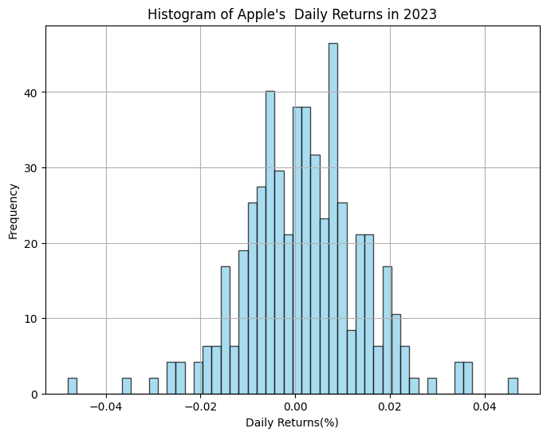

+++
title= 'Exploring CDF vs PPF in SciPy: Understanding Probability Functions'
date = '2024-01-08T14:34:27.000'
description= 'Explore the difference and significance of Probability Point Function (PPF) and Cumulative Distribution Function (CDF) in probability theory.'
math = true
tags = ['statistics']
+++

Photo by <a href="https://unsplash.com/@stumpie10?utm_content=creditCopyText&utm_medium=referral&utm_source=unsplash">Robert Stump</a> on <a href="https://unsplash.com/photos/red-and-white-dice-lot-pQyTChJwEDI?utm_content=creditCopyText&utm_medium=referral&utm_source=unsplash">Unsplash</a>

## Introduction

In probability theory, the Probability Point Function (PPF) and Cumulative Distribution Function (CDF) serve as fundamental tools in understanding and quantifying uncertainty within random variables. In this blog, we delve into the significance, applications, and practical implementation of PPF and CDF by analyzing the daily return of Apple's stock price in 2023. Meanwhile, we will introduce [SciPy](https://scipy.org/), an open-source Python library designed for scientific and technical computing.

## Cumulative Distribution Function (CDF)

### Definition

The Cumulative Distribution Function (CDF) is a function that describes the probability distribution of a random variable by specifying the probability that the variable will be less than or equal to a certain value. In simpler terms, it gives the probability of a random variable taking on a value less than or equal to a specified number.

Mathematically, for a random variable X, the CDF is denoted as F(x) and is expressed as:


$ F(x) = P(X \leq x)$, for all $x \in \R $


## Probability Point Function (PPF) or Inverse Cumulative Distribution Function (CDF)

### Definition

The Probability Point Function (PPF), also known as the inverse cumulative distribution function, operates inversely to the CDF. It takes a probability value as input and returns the corresponding value of the random variable for which the CDF equals that probability.

Mathematically, if F(x) is the CDF of a random variable X, then the PPF is denoted as $F^{-1}(p)$ and is expressed as:

$F^{-1}(p)= x$, such that $F(x) = p$

The PPF is particularly useful in statistics for determining values associated with specific probabilities, such as percentiles or critical values.

## Contrasting PPF and CDF

- **Functionality**

  CDF provides the probability of the variable being less than or equal to x;

  PPF helps to find the value associated with a given probability.

- **Usage**

  CDF is fundamental for understanding the overall behavior of a probability distribution.

  PPF mainly used for determining critical values or thresholds.

- **Representation**

  CDF: Graphically represents the cumulative probability distribution, usually starting from 0 to 1, illustrating how probabilities accumulate as values increase.

  PPF: Graphically represents the inverse of the cumulative distribution function, plotting the values of the random variable against probabilities, showing the values associated with specific probabilities.

## Practical Example in `Scipy`

In this example, we'll demonstrate the concepts of PPF and CDF within SciPy. We'll use the daily returns of Apple (AAPL) in 2023 as our dataset.

### Get Stock Return Data Using `yfinance`

```python
# For getting historical financial data
import yfinance as yf
# For scientific computing in statistics
from scipy.stats import norm
# For plotting and visualization
import matplotlib.pyplot as plt

# Fetch AAPL data
stock_data = yf.download('AAPL', start='2023-01-01', end='2023-12-31')
# Get a concise summary of our DataFrame
stock_data.info()

"""
<class 'pandas.core.frame.DataFrame'>
DatetimeIndex: 250 entries, 2023-01-03 to 2023-12-29
Data columns (total 6 columns):
 #   Column     Non-Null Count  Dtype
---  ------     --------------  -----
 0   Open       250 non-null    float64
 1   High       250 non-null    float64
 2   Low        250 non-null    float64
 3   Close      250 non-null    float64
 4   Adj Close  250 non-null    float64
 5   Volume     250 non-null    int64
dtypes: float64(5), int64(1)
memory usage: 13.7 KB
"""

# Get the daiily return using `pct_change()`, remove missing values
stock_returns = stock_data['Adj Close'].pct_change().dropna()
```

### Inspect the distribution by plotting histogram of daily returns

```python
# Inspect the distribution by plotting histogram of daily returns
plt.figure(figsize=(8, 6))
plt.hist(stock_returns, bins=50, density=True, alpha=0.7, color='skyblue', edgecolor='black')
plt.title('Histogram of Apple Inc. (AAPL)  Daily Returns in 2023')
plt.xlabel('Daily Returns(%)')
plt.ylabel('Frequency')
plt.grid(True)
plt.show()
```



### Construct the norm distribution in `SciPy`

```python
# Calculate mean and standard deviation of daily stock returns
mean_return = stock_returns.mean()
std_deviation = stock_returns.std()

# Create a normal distribution based on the calculated mean and standard deviation
appl_daily_return_distribution = norm(loc=mean_return, scale=std_deviation)
```

### Calculating CDF and PPF in `SciPy`

The `.cdf()` and `.ppf()` methods in SciPy are essential functionalities within the `scipy.stats` module that handle Cumulative Distribution Function (CDF) and Probability Point Function (PPF), respectively, for various probability distributions.

```python
# CDF
appl_daily_return_distribution.cdf(0.01)

# 0.7420136860623278
# 74.20% of the daily returns of Apple is less or equal to 1%

appl_daily_return_distribution.cdf(0.005)
# 0.5994001904523659
# 59.94% of the daily returns of Apple is less or equal to 0.5%

appl_daily_return_distribution.cdf(0.01) - appl_daily_return_distribution.cdf(0.005)

# 0.14261349560996184
# 14.26% of the daily returns of Apple is greater than 0.5% and less or equal to 1%
```

```python
# PPF
appl_daily_return_distribution.ppf(0.9)

# 0.017944086843352632
# The value of which 90% of all the daily returns are less or equal to is 1.79%

appl_daily_return_distribution.ppf(1 - 0.9)
# -0.014274232117790355
# The value of which 90% of all the daily returns are less or equal to is -1.42%
# In other words, the value of which 90% of all the daily returns are greater to is -1.42%.
```

### Visualize the Distribution

#### CDF

```python
# Calculate the CDF for a range of values
x_values = sorted(stock_returns)
y_cdf = appl_daily_return_distribution.cdf(x_values)

# Plotting the Cumulative Distribution Function (CDF)
plt.figure(figsize=(8, 6))
plt.plot(x_values, y_cdf, label='CDF')
plt.title("Cumulative Distribution Function (CDF) of Apple's Stock Daily Returns in 2023")
plt.xlabel('Daily Returns(%)')
plt.ylabel('Cumulative Probability')
plt.legend()
plt.grid(True)
plt.show()
```


### PPF

```python
# Calculate the PPF for a range of probabilities
probabilities = [0.05, 0.25, 0.5, 0.75, 0.95]
x_ppf = appl_daily_return_distribution.ppf(probabilities)

# Plotting the Probability Point Function (PPF)
plt.figure(figsize=(8, 6))
plt.plot(probabilities, x_ppf, marker='o', linestyle='None', label='PPF')
plt.title("Probability Point Function (PPF) of of Apple's Stock Daily Returns in 2023")
plt.xlabel('Probability')
plt.ylabel('Stock Daily Returns(%)')
plt.legend()
plt.grid(True)
plt.show()
```


## Conclusion

In summary, while the CDF gives the probability that a random variable is less than or equal to a particular value, the PPF helps in finding the value of the random variable for a given probability. They are complementary functions often used together in statistical analysis and probability calculations.
