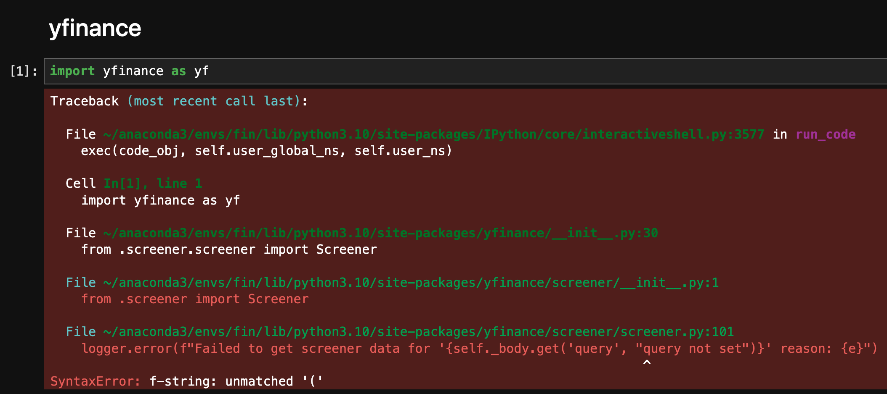
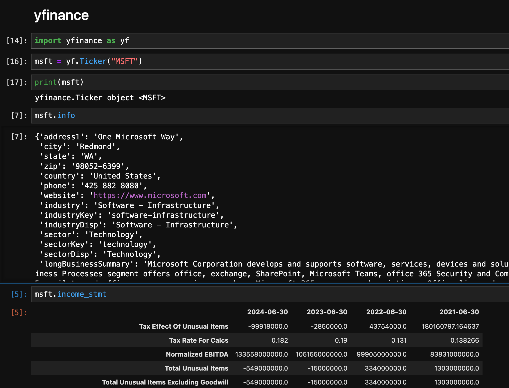

+++
title = "How to Fix the f-string Error: Unmatched '(' in yfinance"
tags = ['Python', 'yfinance']
date= "2024-10-21"
descriptio = "Encountering an f-string: unmatched '(' error while using yfinance version 0.2.45 in Python? This blog explains the root cause of the error, which is a syntax issue in the source code, and provides two easy solutions: downgrading yfinance or manually editing the problematic line. Follow this guide to quickly resolve the issue and get back to analyzing financial data with yfinance."
+++


If you're using the latest version of the yfinance library (version `0.2.45` as of now), you might encounter the following error:

```bash
Traceback (most recent call last):

  File ~/anaconda3/envs/fin/lib/python3.10/site-packages/IPython/core/interactiveshell.py:3577 in run_code
    exec(code_obj, self.user_global_ns, self.user_ns)

  Cell In[1], line 1
    import yfinance as yf

  File ~/anaconda3/envs/fin/lib/python3.10/site-packages/yfinance/__init__.py:30
    from .screener.screener import Screener

  File ~/anaconda3/envs/fin/lib/python3.10/site-packages/yfinance/screener/__init__.py:1
    from .screener import Screener

  File ~/anaconda3/envs/fin/lib/python3.10/site-packages/yfinance/screener/screener.py:101
    logger.error(f"Failed to get screener data for '{self._body.get('query', "query not set")}' reason: {e}")
                                                                              ^
SyntaxError: f-string: unmatched '('
```



Don't worry! This error is a known issue with the yfinance `0.2.45` source code, and it's easy to fix. Below, I’ll explain what causes this error and two simple ways to resolve it.

## Why This Happens

The issue occurs in this line of the [yfinance source code](https://github.com/ranaroussi/yfinance/blob/main/yfinance/screener/screener.py#L101):

```py
logger.error(f"Failed to get screener data for '{self._body.get('query', "query not set")}' reason: {e}")
```

The problem lies in the mixing of single and double quotes inside the `.get()` method. Python tries to process both `'query'` and `"query not set"` within the same string, causing confusion. Since the string started with a single quote, Python expects a matching single quote but encounters a double quote, leading to a **syntax error**.

## Two Simple Fixes

You can fix this issue in one of two ways: either by downgrading to an earlier version of yfinance or by manually correcting the source code. Here’s how:

### 1. Downgrade to a Previous yfinance Version

If you don’t need the latest features of yfinance `0.2.45`, simply downgrade to version `0.2.44` by running this command in your terminal:

```bash
pip install --force-reinstall -v "yfinance==0.2.44"
```

After downgrading, restart your Jupyter notebook, and the issue should be resolved.

### 2. Manually Edit the Source Code

If you prefer to stick with yfinance `0.2.45` for its new features, you can manually correct the problematic line in the source code.

Follow these steps:

1. Locate the file: `yfinance/screener/screener.py`.
2. Find the offending line:

```bash
logger.error(f"Failed to get screener data for '{self._body.get('query', "query not set")}' reason: {e}")
```

and change it to

```bash
logger.error(f"Failed to get screener data for '{self._body.get('query', 'query not set')}' reason: {e}")
```

This small change ensures consistent use of single quotes, preventing the syntax error.



## Conclusion

This error in yfinance version `0.2.45` is easily fixable, either by downgrading to a previous version or manually editing the source code. Choose the method that works best for your needs, and you’ll be back to analyzing financial data in no time!
