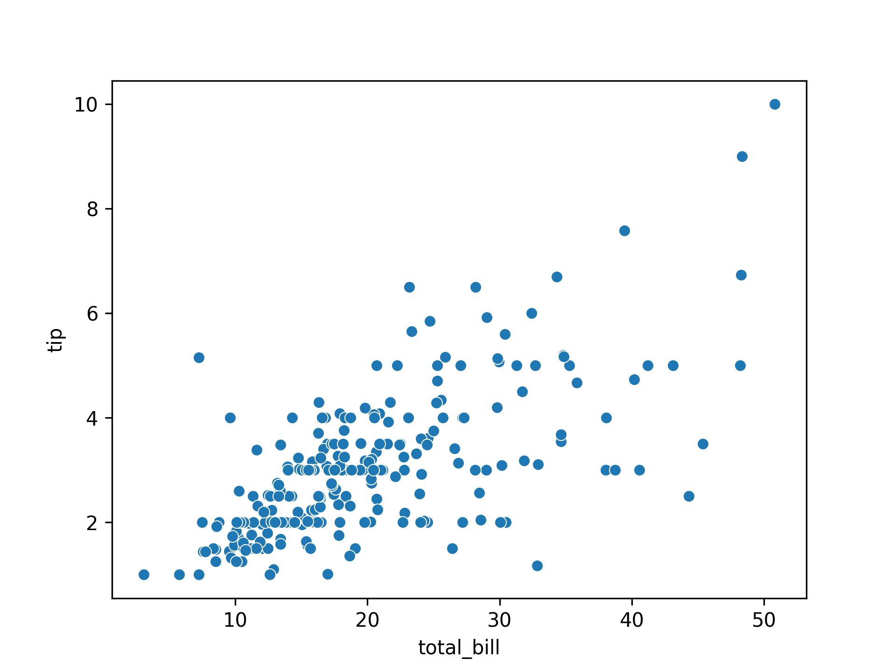
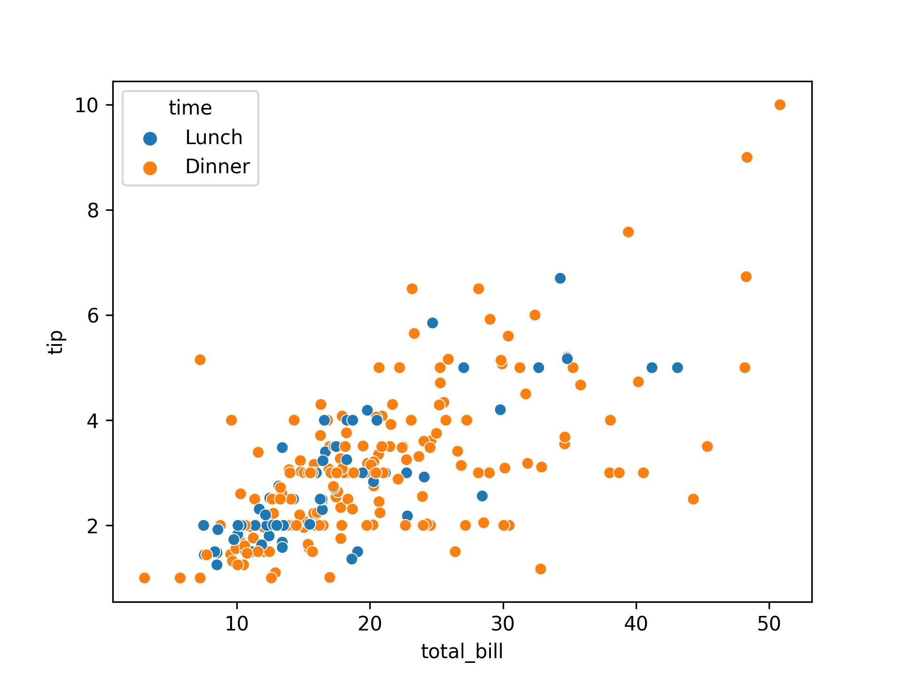
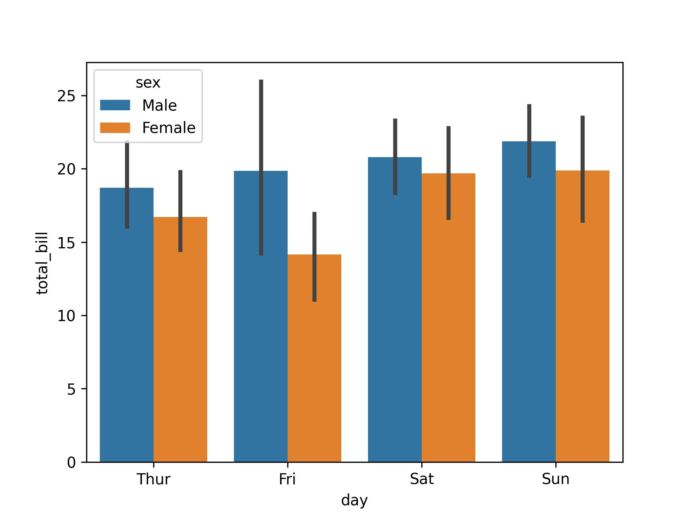
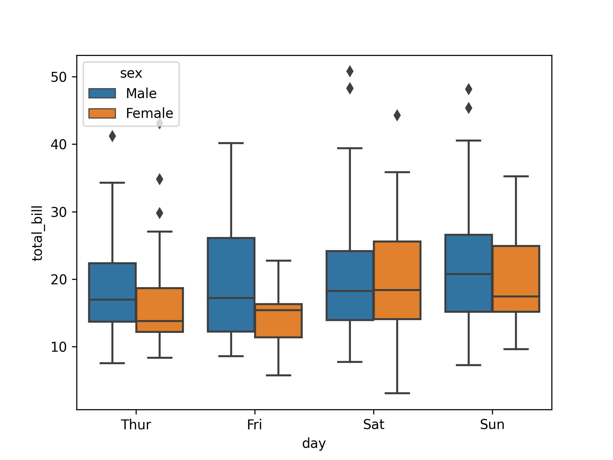
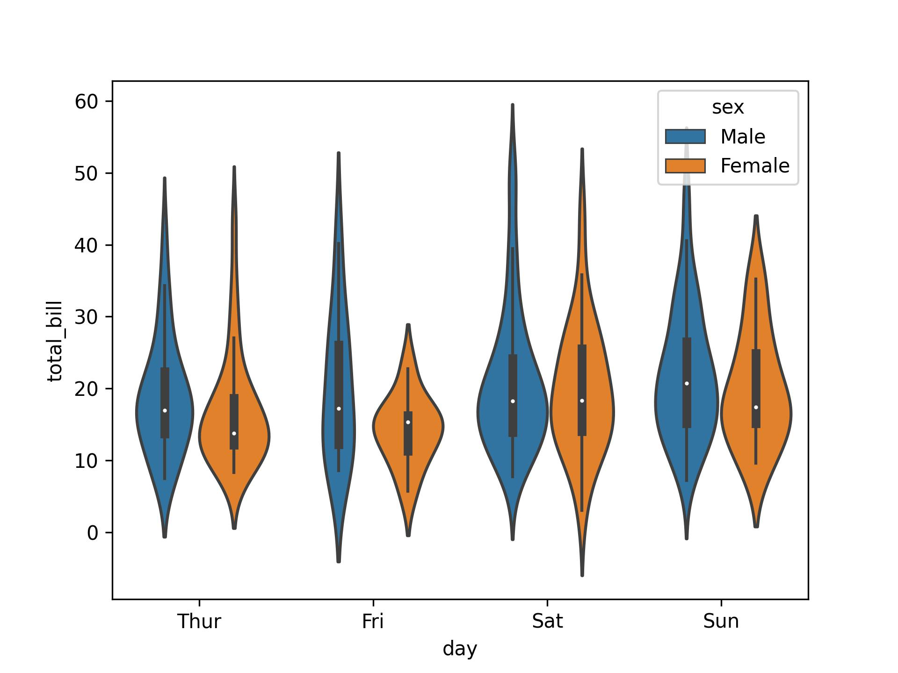
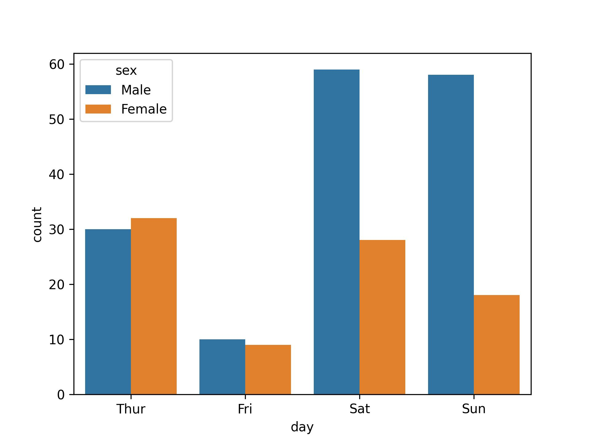

Photo by <a href="https://unsplash.com/@ro_ka?utm_content=creditCopyText&utm_medium=referral&utm_source=unsplash">Robert Katzki</a> on <a href="https://unsplash.com/photos/multicolored-wall-in-shallow-focus-photography-jbtfM0XBeRc?utm_content=creditCopyText&utm_medium=referral&utm_source=unsplash">Unsplash</a>

The `hue` parameter in [Seaborn](https://seaborn.pydata.org/) allows for the seamless integration of categorical variables, introducing a spectrum of colors that not only enhances the aesthetic appeal of your plots but also provides a powerful tool for conveying intricate relationships within your data. In this blog, we will embark on a journey to explore the nuances of using 'hue' in Seaborn, unlocking its potential to reveal insights, distinguish patterns, and elevate the clarity of your visual narratives.

## 📊 Usage

Firstly, We will load `tips` dataset from the online repository in Seaborn. This dataset contains the following data:

> One waiter recorded information about each tip he received over a period of a few months working in one restaurant

```python
import seaborn as sns
import matplotlib.pyplot as plt

# Load sample data
data = sns.load_dataset("tips")
```

Like always, We will inspect our data then:

```python
data.info()

"""
<class 'pandas.core.frame.DataFrame'>
RangeIndex: 244 entries, 0 to 243
Data columns (total 7 columns):
 #   Column      Non-Null Count  Dtype
-- -----     ------------- -----
 0   total_bill  244 non-null    float64
 1   tip         244 non-null    float64
 2   sex         244 non-null    category
 3   smoker      244 non-null    category
 4   day         244 non-null    category
 5   time        244 non-null    category
 6   size        244 non-null    int64
dtypes: category(4), float64(2), int64(1)
memory usage: 7.4 KB
"""
```

According to the [dataset description](https://rdrr.io/cran/reshape2/man/tips.html), each variable has the following meaning:

total_bill: bill in dollars,
tip: tip in dollars,
sex: sex of the bill payer,
smoker: whether there were smokers in the party,
day: day of the week,
time: time of day,
size: size of the party.

<Table
	header={['Name', 'Meaning']}
	tableRows={[
		['total_bill', 'bill in dollars'],
		['tip', 'tip in dollars'],
		['sex', 'sex of the bill payer'],
		['smoker', 'whether there were smokers in the party'],
		['day', 'day of the week'],
		['time', 'time of day'],
		['size', 'size of the party']
	]}
/>

### Scatter Plots

In this example, we'll compare a simple scatter plot with and without `hue` to showcase how it can enhance our understanding of the data.

Without `hue`

```python
sns.scatterplot(x="total_bill", y="tip", data=data)
```



With `hue`

```python
sns.scatterplot(x="total_bill", y="tip", hue="time", data=data)
```



In this example, we compare two scatter plots side by side. The left plot (without `hue`) shows a basic scatter plot of total bill amount vs. tip without distinguishing different days. The right plot (with `hue`) introduces the 'day' column as the `hue` parameter, coloring the points based on the days of the week.

By using `hue`, we can observe how the relationship between total bill and tip varies across different time. This additional categorical information enhances the visualization, making it easier to differentiate patterns and trends within the data.

### Bar Plots

```python
sns.barplot(x="day", y="total_bill", hue="sex", data=data)
```



### Box Plots

```python
sns.boxplot(x="day", y="total_bill", hue="sex", data=data)
```



### Violin Plots

```python
sns.violinplot(x="day", y="total_bill", hue="sex", data=data)
```



### Count Plots

```python
sns.countplot(x="day", hue="sex", data=data)
```



## 🤔 When to Use and When Not to Use `hue`?

The use of `hue` is particularly beneficial in the following cases:

- **Visualizing Categorical Relationships:**
  When you are visualizing relationships between two numeric variables and have a third categorical variable that you want to explore simultaneously.

- **Highlighting Patterns or Trends:**
  When you want to highlight patterns, trends, or differences in your data by using different colors for different categories.

- **Enhancing Interpretability:**
  When you want to enhance the interpretability of your visualizations by adding an extra layer of information through color.

While the `hue` parameter in Seaborn can be a powerful tool for enhancing visualizations by incorporating an additional categorical variable, there are situations where it might not be necessary or could potentially lead to confusion:

- **Limited or No Categorical Data :**
  If your dataset has very limited categorical data or if the categorical variable doesn't provide meaningful insights into the patterns you are exploring, using `hue` might not add much value.
  When the variable specified in `hue` is not categorical, but rather a continuous variable, using `hue` may not be appropriate. In such cases, alternative approaches like color gradients or size encoding might be more suitable.

- **Overcrowded Plots:**
  When the number of categories within the `hue` variable is large, it can lead to overcrowded plots with too many colors, making it difficult to distinguish and interpret the information.

- **Color Vision Impairments:**
  Consider the audience of your visualizations. If there is a possibility that the audience includes individuals with color vision impairments, relying heavily on color differentiation (such as with `hue`) might limit accessibility. Ensure your visualizations are still interpretable in grayscale.

## Conclusion

In conclusion, Seaborn's `hue` parameter is a dynamic tool that breathes vitality into visualizations, providing nuanced insights across plot types, from scatter plots to count plots. By introducing an additional layer of categorical information, `hue` unveils hidden patterns and relationships. However, its use should be judicious, especially when simplicity is crucial.
