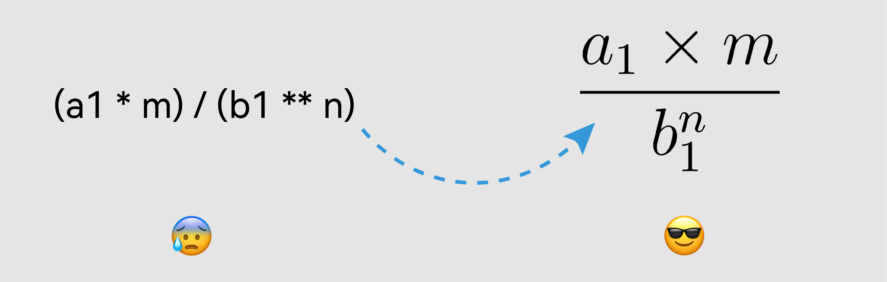

Photo by <a href="https://unsplash.com/@artturijalli?utm_content=creditCopyText&utm_medium=referral&utm_source=unsplash">Artturi Jalli</a> on <a href="https://unsplash.com/photos/a-chalkboard-with-some-writing-on-it-gYrYa37fAKI?utm_content=creditCopyText&utm_medium=referral&utm_source=unsplash">Unsplash</a>

Mathematical expressions play a crucial role in conveying complex ideas, especially in technical content. In this blog, we'll explore how to enable math typesetting in Astro .mdx files using the powerful combination of `remark-math` and `rehype-katex`.



## Step 1: Package installation

To kickstart the process, we need to install the necessary packages – `remark-math` and `rehype-katex`. Open your terminal and run the following command:

```shell
$ npm install remark-math rehype-katex
```

- `remark-math`: This package extends Markdown's capabilities, allowing seamless support for mathematical expressions.

- `rehype-katex`: Specifically designed to work with KaTeX, this package handles the rendering of mathematical expressions in Markdown files with speed and efficiency.

## Step 2: Modifying the Astro config file

Now, let's modify the Astro config file (`astro.config.ts` or `astro.config.mjs`) to incorporate these packages. Import and enable `remark-math` and `rehype-katex` as shown below:

```ts
import { defineConfig } from 'astro/config'
import remarkMath from 'remark-math'
import rehypeKatex from 'rehype-katex'

export default defineConfig({
	//
	markdown: {
		remarkPlugins: [remarkMath],
		rehypePlugins: [
			[
				rehypeKatex,
				{
					// Katex plugin options
				}
			]
		]
	}
})
```

## Step 3: Use Auto-render Extension in Katex

To render math across the entire HTML page, we'll add the Auto-render Extension of KaTeX in the head tag of our Astro layout file for Markdown pages. Locate or create the layout file under `./src/layouts/`. Find the latest Katex code snippet on [Auto-render Extension](https://katex.org/docs/autorender).

```html
<html lang="en" class="scroll-smooth">
	<head>
		<!-- Katex -->
		<link
			rel="stylesheet"
			href="https://cdn.jsdelivr.net/npm/katex@0.16.9/dist/katex.min.css"
			integrity="sha384-n8MVd4RsNIU0tAv4ct0nTaAbDJwPJzDEaqSD1odI+WdtXRGWt2kTvGFasHpSy3SV"
			crossorigin="anonymous"
		/>
		<script
			defer
			src="https://cdn.jsdelivr.net/npm/katex@0.16.9/dist/katex.min.js"
			integrity="sha384-XjKyOOlGwcjNTAIQHIpgOno0Hl1YQqzUOEleOLALmuqehneUG+vnGctmUb0ZY0l8"
			crossorigin="anonymous"
		></script>
		<script
			defer
			src="https://cdn.jsdelivr.net/npm/katex@0.16.9/dist/contrib/auto-render.min.js"
			integrity="sha384-+VBxd3r6XgURycqtZ117nYw44OOcIax56Z4dCRWbxyPt0Koah1uHoK0o4+/RRE05"
			crossorigin="anonymous"
			onload="renderMathInElement(document.body);"
		></script>
	</head>

	<body>
		<slot />
	</body>
</html>
```

## Conclusion

Enabling math typesetting in Astro .mdx files is a streamlined process with the powerful combination of `remark-math` and `rehype-katex`. This integration enhances your content, allowing you to seamlessly include and beautifully render mathematical expressions, providing clarity and precision to your readers. Whether you're a technical author or anyone dealing with mathematical content, this approach ensures a smooth workflow and an enhanced reading experience.
