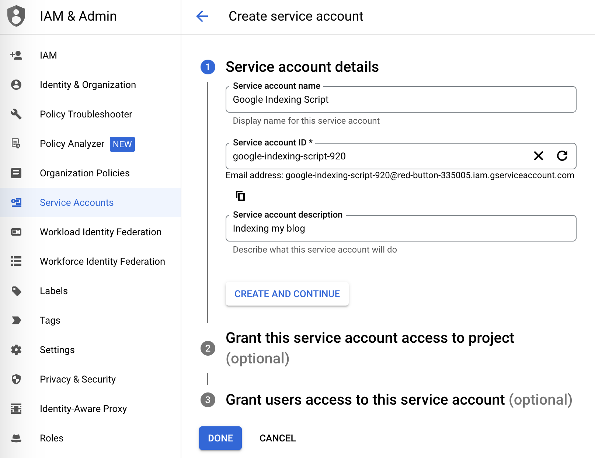
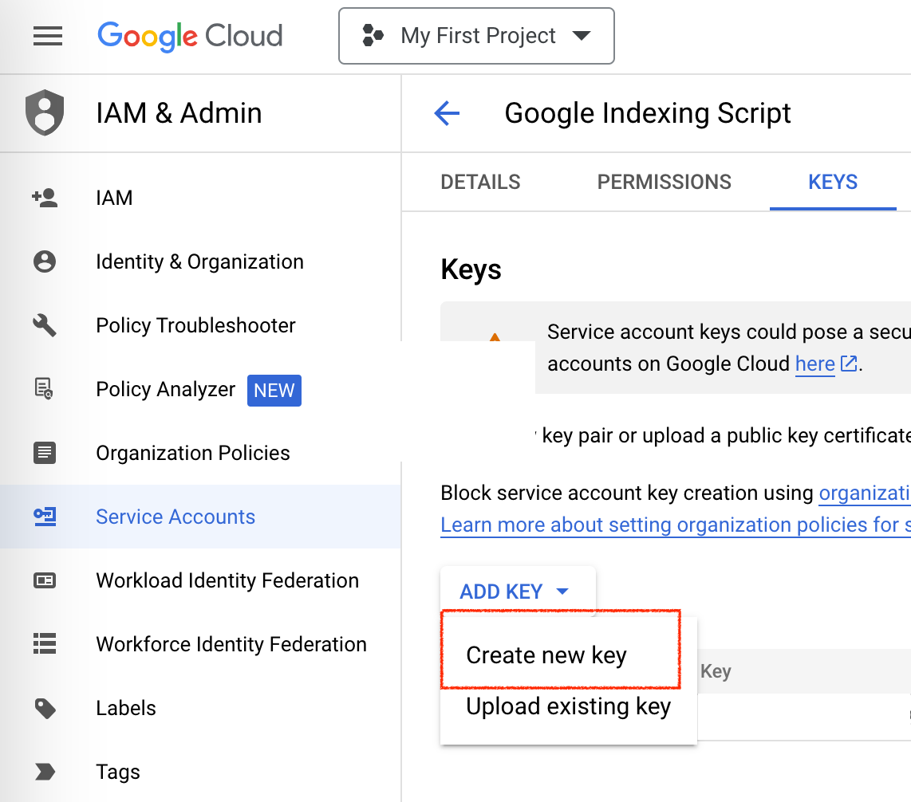
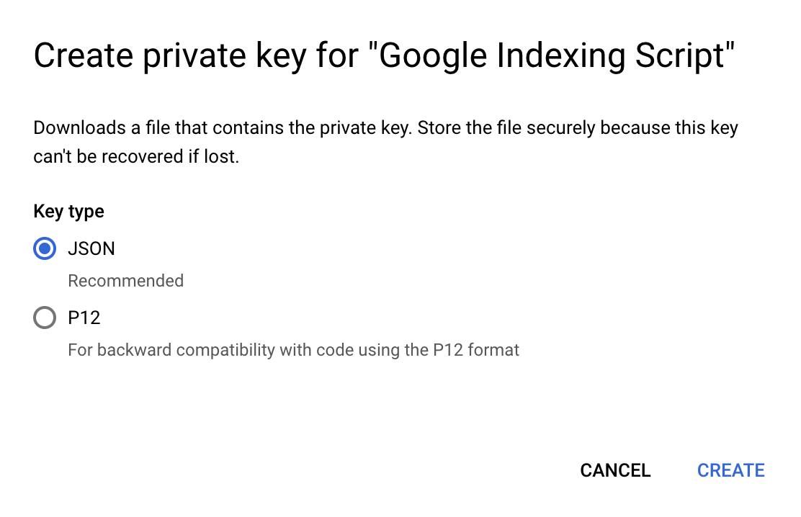
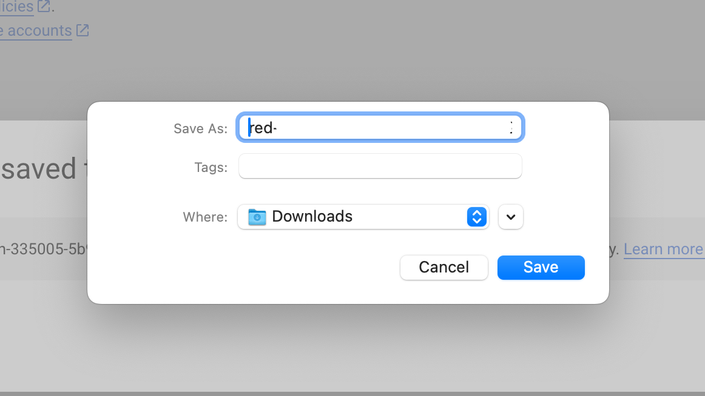
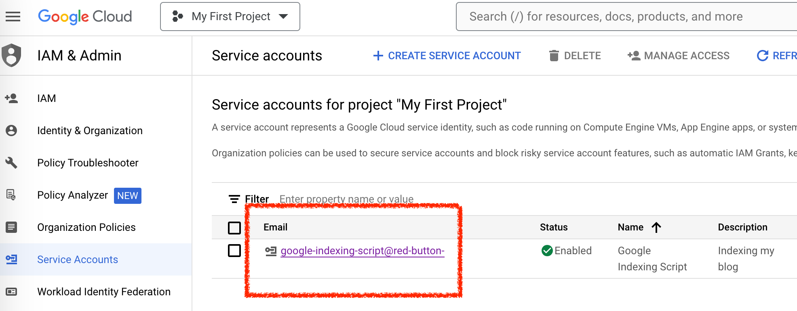
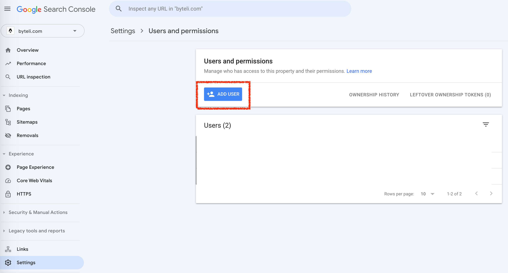
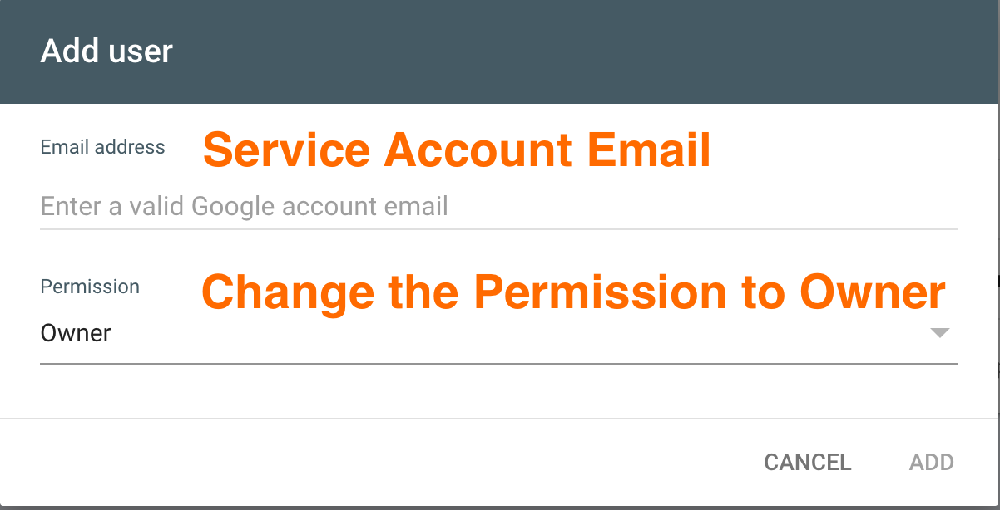
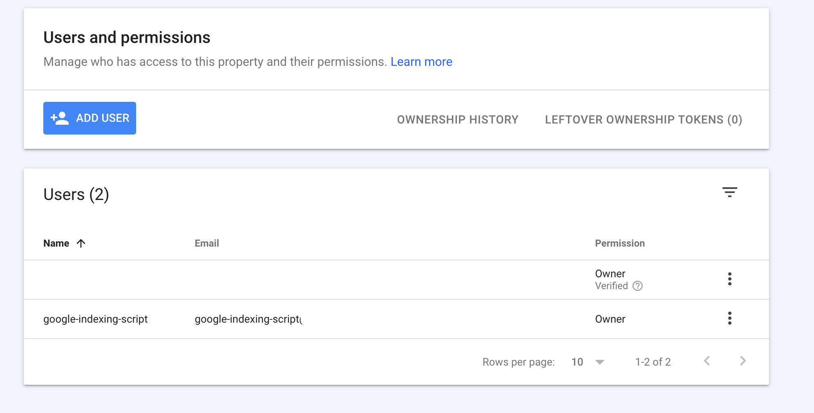
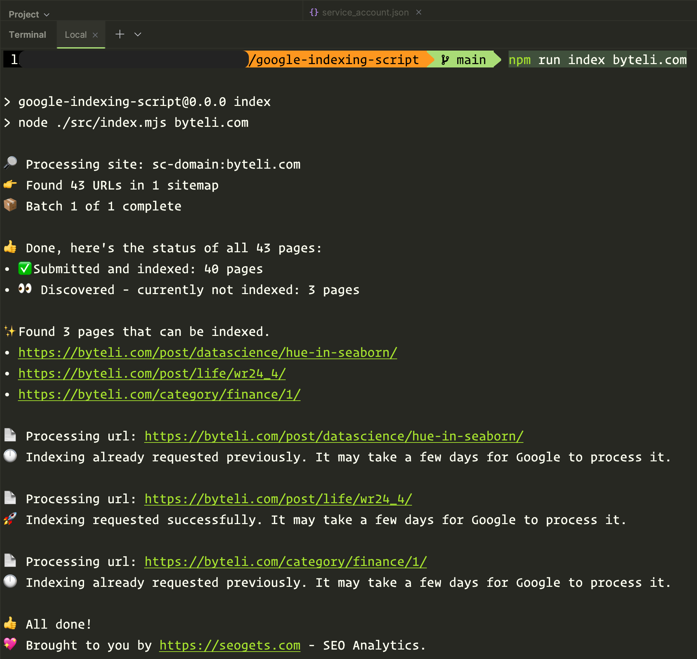

Ever since I launched my blog, I have often encountered the same indexing problem with Google - it takes far too long for my newly published posts to be indexed, and I have to manually submit them using a URL inspection tool - which is tedious and annoying. Until recently, I found this [Google Indexing Script](https://github.com/goenning/google-indexing-script) on GitHub and use this script to submit new links to Google and get them indexed, and the problem has just been solved.

In this blog, I will walk you through all the technical settings of this lightweight yet powerful tool and end up getting your site indexed in Google within 48 hours.

## 🔗 Google Account Preparation

Register a [Google Cloud](https://console.cloud.google.com/) account

Enable Google Search API [here](https://console.cloud.google.com/marketplace/product/google/searchconsole.googleapis.com?q=search&referrer=search&project=red-button-335005).

Enable Web Search Indexing API [here](https://console.cloud.google.com/marketplace/product/google/indexing.googleapis.com?q=search&referrer=search&project=red-button-335005).

### Create a service account

Create a service account [here](https://console.cloud.google.com/iam-admin/serviceaccounts?project=red-button-335005)



Then click the service account we just created, and go to the `Keys` panel to create a new key.

## 





Then a window will pop up and we just download the key we generated; Then, we change its name to `service_account.json`.



### Add your service account to Google console as Owner

Copy our service account email to clipboard, we will use this in a moment.



Visit Google Console. In 'Settings' panel, click 'add user'. Then, in the pop-up window, paste our service account email and make sure the permission is set to 'Owner'






After clicking 'Add', you service account should be successfully added to Google Console:




## 🛠️ Environment Preparation

### Node.js

Go to [Node.js](https://nodejs.org/en/download/) , download and install the Latest LTS Version of Node.js, it's `20.11.0` at current time.

Open the terminal of your computer, check whether Node.js has successfully installed

```shell
node -v
# 20.11.0
```

### Git

You can check whether you have installed `Git` by running this command in the terminal

```shell
git version
# git version 2.33.0
```

If you haven't installed it, you can refer to [this guide](https://github.com/git-guides/install-git).

## ✏️ Script Configuration

This is the last step in our progress.

### download the script

use this command to download the script into our local computer:

```shell
git clone https://github.com/goenning/google-indexing-script.git
```

### install dependencies

Open the folder we just downloaded in an IDE; I personally use 'WebStorm'. Then, in the terminal, run the following command to install all the necessary dependencies of this script.

```shell
npm install
```

### set the credentials

Move the `service_account.json` we downloaded in previous step to the same same folder as the script.

The directory should be the following:

```markdown
.
├── LICENSE
├── README.md
├── output.png
├── package-lock.json
├── package.json
├── src
├── node_modules
└── service_account.json
```

### Run the Script

In the terminal, run

```shell
npm run index yourWebsiteDomain.com
# OR
npm run index https://yourWebsiteDomain.com
```

For instance, since the domain of my blog is 'byteli', so I just run

```shell
npm run index byteli.com
```

And we just submitted the unindexed pages in seconds 🎉



### Check the Updates

In one or two days, visit [Google Search Console](https://search.google.com/search-console/about), under 'Indexing' - 'Pages', you can view the updates of the newly indexed pages.

## 🎉 Conclusion

In conclusion, overcoming the frustration of delayed Google indexing is a game-changer for any blogger. The journey outlined in this blog, from Google account preparation to environment setup and script configuration, provides a comprehensive guide to tackle the indexing challenge effectively. As you embark on this journey, embrace the power of automation and witness the positive impact on your blog's discoverability. Happy blogging!
